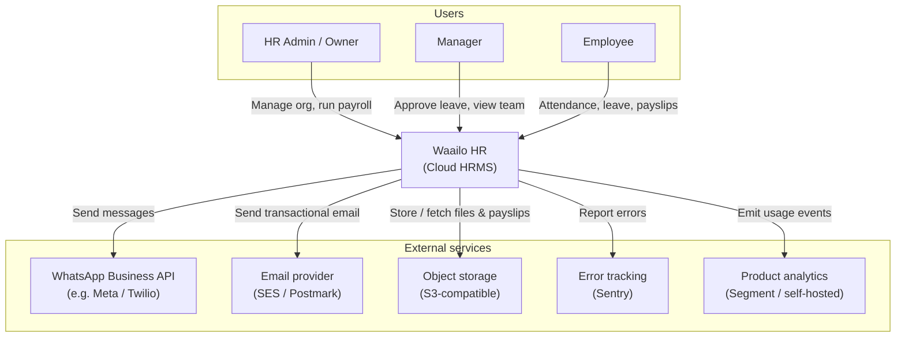
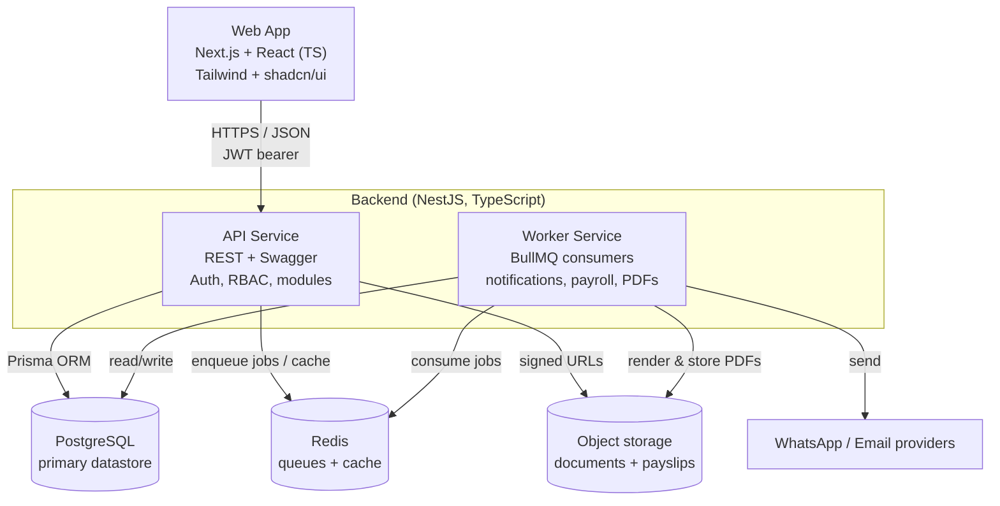
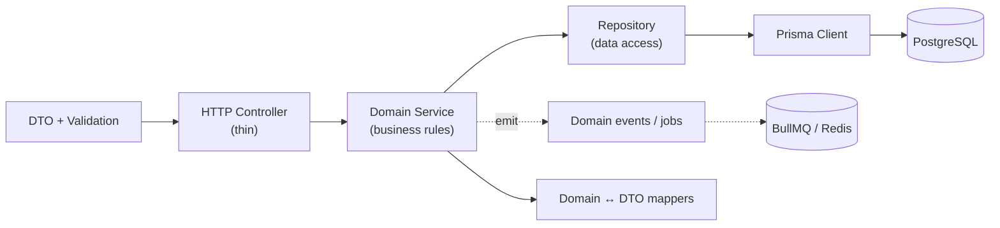
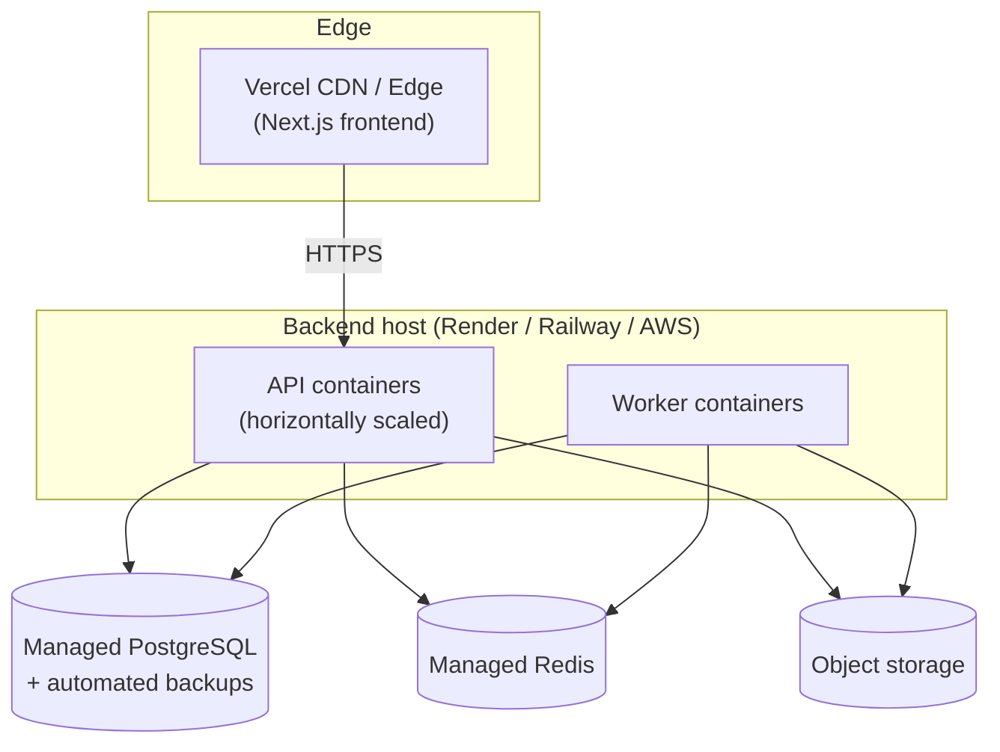

# 02 — High-Level Architecture

This document describes the system at the architecture level: the actors and external
systems it talks to, the deployable units, the technology stack, the multi-tenancy model,
and the cross-cutting concerns that every module inherits.

## 2.1 Architectural style

Waailo HR is a **modular monolith** for the backend, organised internally into bounded
contexts (the nine modules). A modular monolith is chosen over microservices because:

- The team is small and the product is early; one deployable unit is cheaper to build,
  test and operate.
- The modules share one transactional database, which keeps strongly-consistent operations
  (e.g. leave approval adjusting a balance) simple.
- Strict module boundaries (enforced in code via NestJS modules and clear public service
  interfaces) keep the option open to extract a module into its own service later if a
  module's load profile demands it (payroll and notifications are the likeliest candidates).

Asynchronous and potentially slow work (sending WhatsApp/email, generating payslip PDFs,
running payroll, document expiry scans) is offloaded to a **background worker** consuming a
Redis-backed BullMQ queue, so HTTP requests stay fast.

## 2.2 System context (C4 — Level 1)

## 2.3 Container view (C4 — Level 2)

The deployable units and the main data stores.

> The API service and the Worker service share the **same codebase** (the NestJS modules)
> but run with different bootstraps: the API exposes HTTP controllers; the Worker registers
> BullMQ processors. This keeps domain logic in one place while letting the two scale
> independently.

## 2.4 Technology stack

| Layer | Choice | Rationale |
|-------|--------|-----------|
| Frontend framework | **Next.js + React** (TypeScript) | SSR/ISR for fast, SEO-friendly marketing + app routes; mature ecosystem |
| Styling / UI kit | **Tailwind CSS + shadcn/ui** | Utility-first speed; accessible, composable components |
| Forms / validation | **React Hook Form + Zod** | Performant forms; Zod schemas shared with API contracts |
| Client state | **React Context + custom hooks**; server state via **TanStack Query** | Avoids prop drilling; caches and dedupes server reads |
| Backend framework | **NestJS** (TypeScript) | Opinionated modules + DI map cleanly to DDD bounded contexts |
| ORM / migrations | **Prisma** | Type-safe queries; declarative schema; first-class migrations |
| Database | **PostgreSQL** | Relational integrity, transactions, JSONB where needed |
| Queue / cache | **Redis + BullMQ** | Reliable background jobs; caching of hot reads |
| Object storage | **S3-compatible** | Documents and generated payslip PDFs |
| Auth | **JWT access + refresh tokens**, bcrypt/argon2 hashing | Stateless API auth; refresh rotation for security |
| API docs | **OpenAPI / Swagger** (auto-generated) | Always-current contract from DTOs |
| Validation (server) | **class-validator + class-transformer** on DTOs | Declarative, fails fast at the boundary |
| Error tracking | **Sentry** | Frontend + backend error monitoring |
| Metrics | **Prometheus + Grafana** | System and app metrics, dashboards, alerts |
| Tests | **Jest** (unit/integration), **Playwright** (E2E), **k6/Artillery** (load) | Layered testing strategy |
| Local dev | **Docker + docker-compose** | Reproducible Postgres + Redis + services |
| Containerisation | **Docker** images per service | Portable deploys |
| Deploy | Frontend on **Vercel**; backend on **Render/Railway/AWS**; CI/CD via pipelines | Managed, low-ops hosting suited to an SMB product |

## 2.5 Internal backend layering (clean architecture)

Within the modular monolith, every module follows the same layered structure so that
business logic stays independent of the framework and the database.

Layer responsibilities:

- **Controller** — translate HTTP ↔ DTO, enforce auth guards, delegate to a service. No
  business logic.
- **Service** — the bounded context's use cases and invariants. Pure-ish; depends on
  repository interfaces, not Prisma directly, so it can be unit-tested with mocks.
- **Repository** — encapsulates persistence; the only layer that touches Prisma. Always
  scopes queries by `company_id`.
- **DTO** — request/response shapes with `class-validator` decorators; also drive Swagger.
- **Domain events / jobs** — side effects (notifications, PDF generation) are enqueued, not
  executed inline.

## 2.6 Multi-tenancy model

Waailo HR uses a **shared database, shared schema** model with a `company_id` discriminator
column on every tenant-owned table. This is the most cost-effective model for SMB scale and
keeps cross-tenant analytics and operations simple.

Isolation is enforced in three layers (defence in depth):

1. **Request context** — on every authenticated request, a middleware/guard extracts the
   `company_id` from the validated JWT and stores it in a request-scoped context.
2. **Repository scoping** — every repository method injects `where: { companyId }`. No
   query may omit it; a lint rule and code review enforce this, and a base repository class
   provides scoped helpers so developers cannot forget.
3. **Database (optional hardening)** — PostgreSQL **Row-Level Security (RLS)** policies keyed
   on a session variable (`app.current_company_id`) provide a backstop even if application
   code is wrong. See [document 07](./07-security-compliance.md).

A small number of tables are **global** (not tenant-scoped): system roles definitions,
country statutory rate tables (EPF/ESI/PT slabs), and the `companies` table itself.

## 2.7 Cross-cutting concerns

These are implemented once and applied across all modules.

| Concern | Mechanism |
|---------|-----------|
| **Authentication** | JWT access token (short-lived) + refresh token (rotated); global `AuthGuard` |
| **Authorisation** | `RolesGuard` + `@Roles()` decorator; resource-level ownership checks in services |
| **Tenancy** | Request-scoped `company_id`; scoped repositories; optional RLS |
| **Validation** | Global `ValidationPipe` (whitelist + transform) on all DTOs |
| **Error handling** | Global `ExceptionFilter` → consistent JSON error envelope (see doc 06) |
| **Logging** | Structured (JSON) logger with request id, company id, user id; no PII in logs |
| **Audit trail** | `AuditInterceptor` + `audit_logs` table for create/update/delete on key entities |
| **Rate limiting** | Per-IP and per-user throttling on auth and write endpoints |
| **Idempotency** | Idempotency keys on payroll runs and notification dispatch to avoid double effects |
| **Configuration** | Typed config module loading from env; validated at boot; secrets via env/secret manager |
| **Observability** | Sentry (errors), Prometheus metrics, health/readiness endpoints |

## 2.8 Environments & deployment topology

Three environments share the same images and differ only by configuration.

| Environment | Purpose | Data |
|-------------|---------|------|
| **Development** | Local laptops via docker-compose | Seeded fake data |
| **Staging** | Pre-production verification, runs migrations first | Anonymised/synthetic |
| **Production** | Live customers | Real, backed up, encrypted |

Deployment characteristics:

- **Stateless API and worker containers** scale horizontally; all state lives in Postgres,
  Redis and object storage.
- **Database migrations** run as a gated pipeline step before new containers receive
  traffic; migrations are forward-only and backward-compatible to allow rolling deploys.
- **Seed scripts** provision reference data (roles, statutory rate tables, default leave
  types) idempotently.
- **Zero-downtime** rollouts via health checks and rolling restarts; rollback by redeploying
  the previous image and, if needed, a compensating migration.

## 2.9 Key architectural decisions (summary)

| Decision | Choice | Main alternative considered |
|----------|--------|------------------------------|
| Backend shape | Modular monolith | Microservices (rejected: premature for SMB scale/team) |
| Tenancy | Shared DB + `company_id` (+ optional RLS) | DB-per-tenant (rejected: ops cost at SMB scale) |
| Async work | BullMQ on Redis | Cloud-native queues (kept portable; can swap later) |
| ORM | Prisma | TypeORM (Prisma chosen for type safety + migrations DX) |
| Auth | Self-managed JWT + refresh | External IdP (can be added later for SSO) |

These decisions and their trade-offs are recorded so that future changes are deliberate.
Each significant change should be captured as an ADR (architecture decision record) and
cross-linked from [document 09](./09-roadmap.md).
