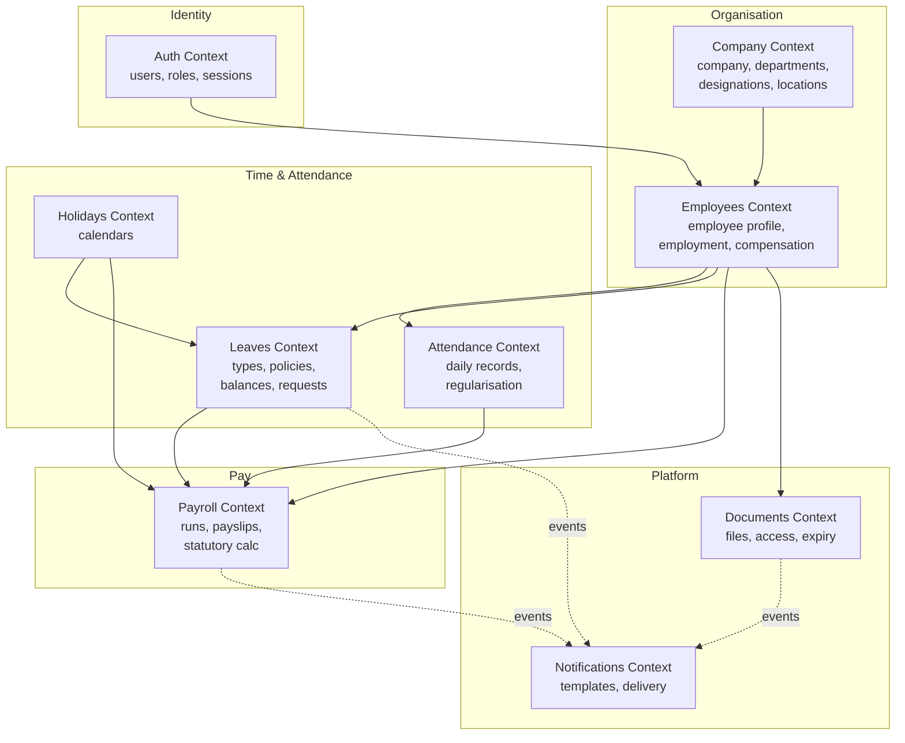
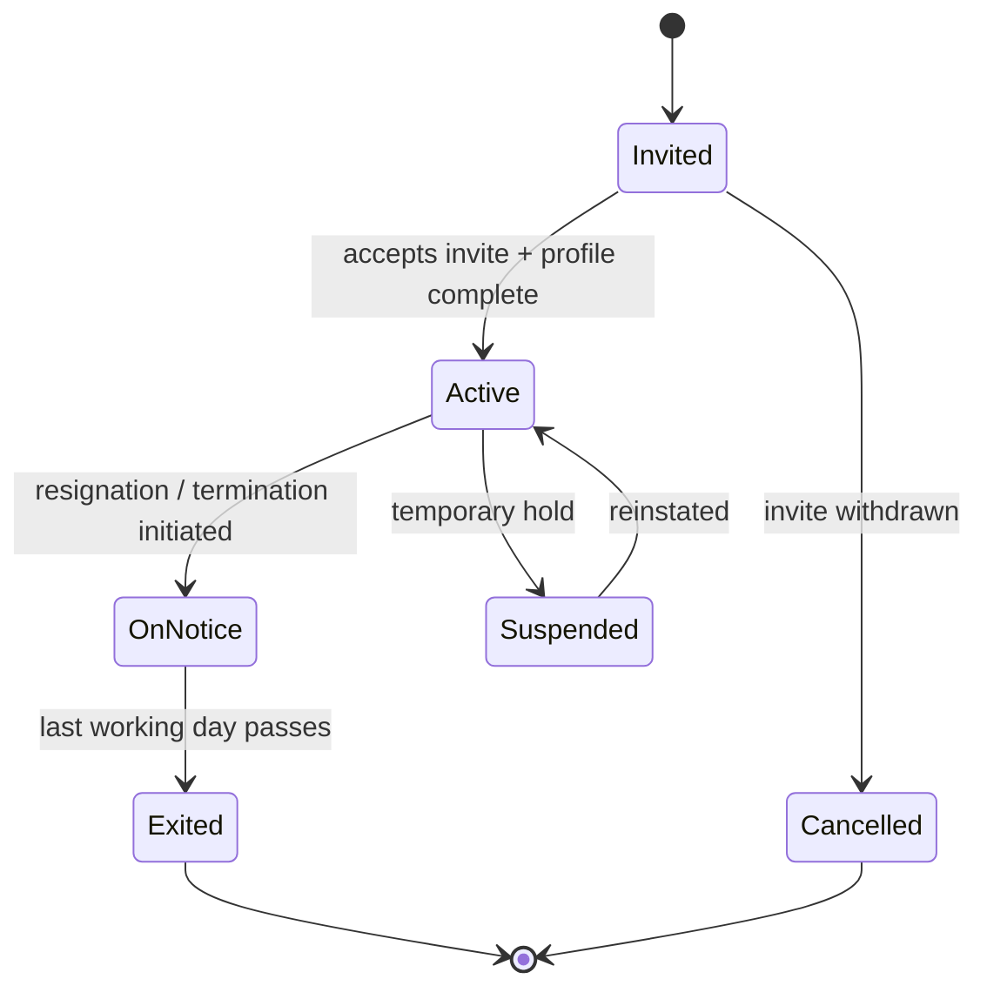
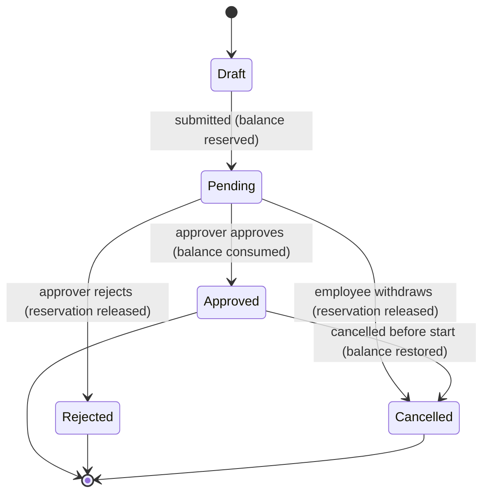
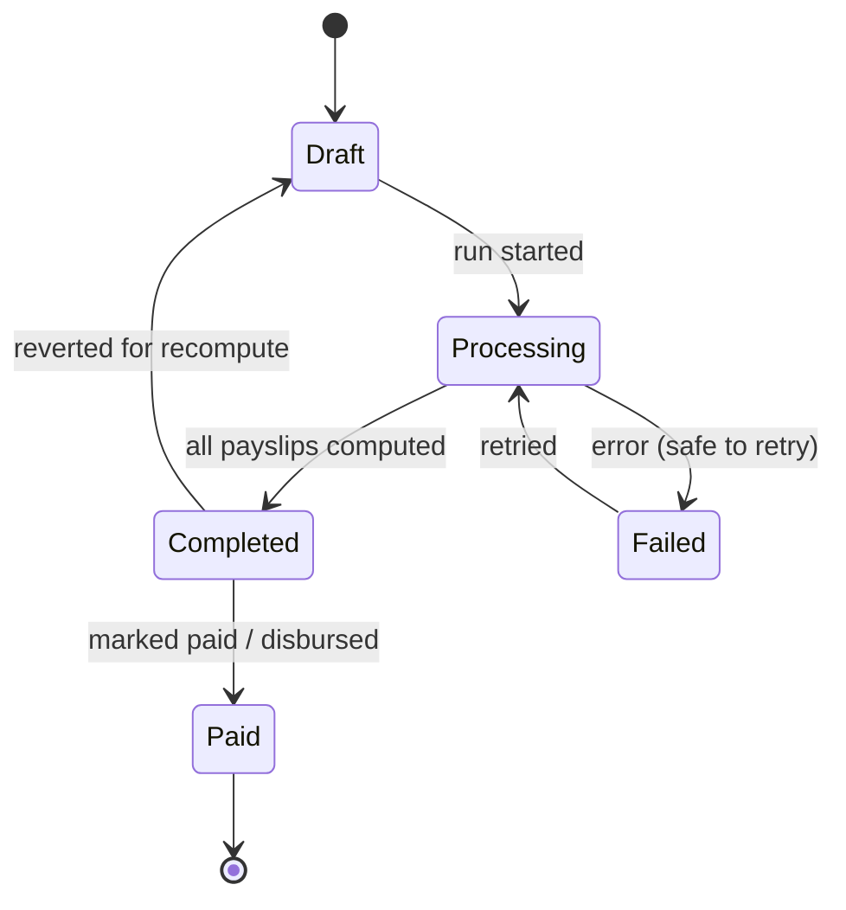

# 03 — Domain Model & Module Boundaries

This document applies Domain-Driven Design (DDD) to Waailo HR. It defines the bounded
contexts, the aggregates and entities inside each, the relationships between contexts (the
context map), and the rules that keep the boundaries clean. The vocabulary here is the
ubiquitous language used in code, the database ([document 04](./04-database-schema.md)) and
the API ([document 06](./06-api-design.md)).

## 3.1 Bounded contexts

Each context maps 1:1 to a backend NestJS module. A context owns its data and exposes
behaviour through a small public service interface; other contexts call that interface
rather than reaching into another context's tables.

## 3.2 Context map (relationships & patterns)

The DDD relationship patterns describe how contexts depend on each other.

| Upstream → Downstream | Pattern | Meaning |
|-----------------------|---------|---------|
| Auth → Employees | Customer/Supplier | An Employee references a User identity; Employees depends on Auth's `userId` |
| Company → Employees | Customer/Supplier | Employee belongs to a Department/Designation/Location owned by Company |
| Employees → Attendance/Leaves/Payroll/Documents | Shared Kernel (Employee identity) | These contexts reference an `employeeId`; the Employee aggregate is the anchor |
| Holidays → Leaves/Payroll | Conformist | Leave-day and payroll-day calculations consume the holiday calendar as-is |
| Attendance + Leaves → Payroll | Customer/Supplier | Payroll consumes monthly attendance summary and approved leave to compute pay days |
| Leaves/Payroll/Documents → Notifications | Published Language (domain events) | Producers publish events; Notifications subscribes and renders templates |

Two integration styles are used deliberately:

- **Synchronous, in-process calls** for queries that need an immediate, consistent answer
  (e.g. Payroll asking Employees for the active employee list and their compensation).
- **Asynchronous domain events** for side effects that must not block the user (e.g. a
  `LeaveDecided` event triggers a WhatsApp/email notification). Events are published to
  BullMQ and consumed by the worker.

## 3.3 Aggregates and invariants

An **aggregate** is a cluster of entities with one **aggregate root** that guards the
cluster's invariants. All writes go through the root. Below are the aggregates per context.

### Auth context

- **User** (root) — identity, credentials (hashed), status, roles. Invariants: email unique
  per company; at least one credential; status transitions are explicit.
- **RefreshToken** — issued, rotated, revoked. Invariant: a revoked token cannot be reused.
- **Role** (mostly reference data) — OWNER, HR_ADMIN, MANAGER, EMPLOYEE.

### Company context

- **Company** (root, the tenant) — name, settings, subscription/plan, country. Invariant:
  a Company always has exactly one OWNER user.
- **Department**, **Designation**, **Location** — reference entities owned by a Company.
  Invariant: names unique within the company.

### Employees context

- **Employee** (root) — personal details, employment (join date, type, department,
  designation, manager), compensation (CTC and structure), statutory IDs, bank details,
  lifecycle status. Invariants:
  - An Employee belongs to exactly one Company.
  - `managerId` must reference an Employee in the same Company and cannot be self.
  - Lifecycle transitions follow the state machine in §3.5.
  - Compensation has exactly one *active* salary structure at a time.

### Attendance context

- **AttendanceRecord** (root) — one (employee, date) record with check-in/out, source,
  status. Invariant: unique per (employee, date); a regularised record links to the request
  that changed it.
- **RegularisationRequest** — proposed correction; approval mutates the record.

### Leaves context

- **LeaveType** + **LeavePolicy** — configuration owned by Company. Invariant: a policy
  belongs to one leave type; accrual and caps are non-negative.
- **LeaveBalance** (root per employee/type/period) — entitled, accrued, used, pending,
  available. Invariant: `available = accrued − used − pending` and never negative.
- **LeaveRequest** (root) — application with date range, type, status, approver. Invariants:
  dates valid and within policy; sufficient balance at apply time; no overlap with an
  existing approved/pending request.

### Holidays context

- **HolidayCalendar** (root) — a year's holidays for a company/location. **Holiday** — a
  dated entry. Invariant: a date appears once per calendar.

### Payroll context

- **PayrollRun** (root) — a period batch with status (DRAFT → PROCESSING → COMPLETED →
  PAID, or FAILED). Invariant: one COMPLETED run per (company, period); idempotent
  recompute.
- **Payslip** — one employee's result within a run, with **EarningLine** and
  **DeductionLine** items. Invariant: `net = sum(earnings) − sum(deductions)`; statutory
  lines computed from current rate tables.

### Documents context

- **Document** (root) — metadata + storage pointer + access rule + optional expiry.
  Invariant: stored object exists; access rule resolves to allowed roles/owner.

### Notifications context

- **NotificationTemplate** — channel + locale + body. **NotificationMessage** (root) — a
  queued/sent message with status and provider response. Invariant: a message references a
  valid template and recipient; delivery is retried with backoff and is idempotent per
  event id.

## 3.4 Domain events (published language)

Events are the contract between producers and the Notifications context (and any future
subscribers such as analytics). Each event is small, names a fact in the past tense, and
carries identifiers rather than whole entities.

| Event | Published by | Typical subscribers |
|-------|--------------|---------------------|
| `EmployeeInvited` | Employees | Notifications (send invite) |
| `EmployeeActivated` | Employees | Notifications, Analytics |
| `LeaveRequested` | Leaves | Notifications (notify approver) |
| `LeaveDecided` (approved/rejected) | Leaves | Notifications (notify employee) |
| `RegularisationDecided` | Attendance | Notifications |
| `PayrollRunCompleted` | Payroll | Notifications (payslips ready) |
| `PayslipPublished` | Payroll | Notifications, Documents (archive PDF) |
| `DocumentExpiringSoon` | Documents | Notifications |
| `BirthdayOrAnniversaryDue` | Employees (scheduled) | Notifications |

## 3.5 Key state machines

State machines make lifecycle invariants explicit and testable.

### Employee lifecycle

### Leave request workflow

### Payroll run status

## 3.6 Module boundary rules

These rules keep the modular monolith from degenerating into a tangle:

1. **No cross-module table access.** A module reads/writes only its own tables via its own
   repositories. To get another context's data, call that context's public service.
2. **Reference by id, not by object graph.** Cross-context links are foreign keys (e.g.
   `employeeId`), not embedded entities from another module.
3. **Side effects via events.** Anything a write *causes* in another context (notifications,
   archiving) is an event handled asynchronously, not an inline call chain.
4. **Public surface is explicit.** Each module exports a thin service interface (its
   "application service"); everything else is internal and not importable by other modules.
5. **Shared kernel is tiny.** Only truly shared concepts (tenant context, common value
   objects like Money, DateRange, and the event bus contracts) live in a `shared` module.

## 3.7 Important value objects

Modelled as small immutable types reused across contexts:

- **Money** — amount (integer minor units) + currency; arithmetic that avoids float errors.
- **DateRange** — start/end with validation, overlap and working-day calculations.
- **TenantContext** — `companyId`, `userId`, roles for the current request.
- **StatutoryId** — typed wrappers (PAN, UAN, ESI number) with format validation.
