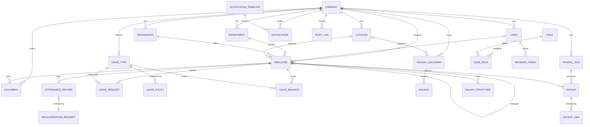

# 04 — Database Schema

This document defines the PostgreSQL data model: the entity-relationship diagram, table
descriptions, indexing and tenancy strategy, and the complete Prisma schema that generates
the migrations. The model implements the aggregates from
[document 03](./03-domain-model.md).

## 4.1 Conventions

- **Primary keys**: UUID (`@default(uuid())`) for all tables — opaque, non-guessable, safe
  to expose in URLs, and friendly to distributed creation.
- **Tenancy**: every tenant-owned table has a non-null `company_id` foreign key. Global
  reference tables (statutory rate slabs, system role definitions) do not.
- **Timestamps**: every table has `created_at` and `updated_at`. Soft-deletable tables add
  a nullable `deleted_at`.
- **Money**: stored as `Int` in **minor units** (paise) with a separate currency on the
  parent (Company), to avoid floating-point rounding errors.
- **Naming**: tables are `snake_case` plural in the database (mapped via `@@map`); Prisma
  models are `PascalCase` singular.
- **Enums**: used for fixed vocabularies (statuses, types) so the database enforces them.
- **Indexes**: a composite index leading with `company_id` on every high-traffic query path;
  unique constraints scoped per company where uniqueness is per-tenant.

## 4.2 Entity-relationship diagram



## 4.3 Table-by-table summary

### Identity & access

- **companies** — the tenant. Holds name, slug, country, currency, plan, settings (JSONB),
  status. Root of every tenant scope.
- **users** — login identities. `email` unique per company, `password_hash`, status,
  `last_login_at`. Optional 1:1 to `employees`.
- **roles** — global reference rows: OWNER, HR_ADMIN, MANAGER, EMPLOYEE.
- **user_roles** — many-to-many join of users ↔ roles (a user may be MANAGER and EMPLOYEE).
- **refresh_tokens** — issued refresh tokens with `hashed_token`, `expires_at`,
  `revoked_at`, `replaced_by` for rotation.

### Organisation

- **departments**, **designations**, **locations** — tenant reference entities; name unique
  per company.
- **employees** — the core HR record. Personal fields, `user_id`, `department_id`,
  `designation_id`, `location_id`, `manager_id` (self-ref), employment type, `date_of_joining`,
  `date_of_exit`, statutory IDs, bank details, `status` lifecycle.
- **salary_structures** — versioned compensation per employee; `is_active` marks the current
  one; components stored as structured lines (basic, HRA, allowances) in `components` JSONB
  plus computed CTC.

### Attendance

- **attendance_records** — one per (employee, date): `check_in_at`, `check_out_at`,
  `work_mode` (ONSITE/WFH), `status` (PRESENT/ABSENT/HALF_DAY/ON_LEAVE/HOLIDAY/WEEKLY_OFF),
  `source`, `worked_minutes`.
- **regularisation_requests** — proposed corrections with `requested_status`, reason,
  approver, decision.

### Leaves & holidays

- **leave_types** — Casual/Sick/Earned/etc per company, with `is_paid`, `code`, `color`.
- **leave_policies** — accrual rule, annual quota, max carry-forward, min/max per request,
  eligibility (e.g. after probation), effective dates.
- **leave_balances** — per (employee, leave_type, period_year): entitled, accrued, used,
  pending, available.
- **leave_requests** — date range, `leave_type_id`, `days`, `status`, approver, decision,
  reason.
- **holiday_calendars** — per company/location/year. **holidays** — dated entries with
  name and optional `is_optional`.

### Payroll

- **payroll_runs** — per (company, period_month, period_year): status, totals, `processed_at`.
- **payslips** — per (run, employee): gross, total_deductions, net, `pdf_object_key`,
  payment status.
- **payslip_lines** — itemised EARNING/DEDUCTION lines with `code`, `label`, `amount`,
  `is_statutory`.
- **statutory_rates** (global) — EPF/ESI/PT/TDS slabs by country and effective date, used to
  compute statutory lines deterministically.

### Platform

- **documents** — metadata + `object_key`, `category`, `access_level`, `owner_employee_id`,
  `expires_at`.
- **notification_templates** — `event_key`, `channel` (WHATSAPP/EMAIL), `locale`, subject,
  body with placeholders.
- **notifications** — `event_key`, `channel`, recipient, rendered payload, `status`
  (QUEUED/SENT/FAILED), `provider_message_id`, retry count.
- **audit_logs** — append-only: actor user, action, entity type, entity id, before/after
  diff (JSONB), ip, timestamp.

## 4.4 Indexing & performance notes

- Composite indexes lead with `company_id`: e.g. `attendance_records (company_id, employee_id, date)`,
  `leave_requests (company_id, status, start_date)`, `payslips (company_id, payroll_run_id)`.
- Unique-per-tenant constraints: `users (company_id, email)`, `employees (company_id, employee_code)`,
  `attendance_records (employee_id, date)`, `leave_balances (employee_id, leave_type_id, period_year)`,
  `holidays (calendar_id, date)`.
- Hot read paths (today's attendance, current leave balances, latest payslip) are cached in
  Redis with short TTLs and invalidated on write — see [document 08](./08-nfr-observability.md).
- `audit_logs` and `attendance_records` grow fastest; they are candidates for monthly
  partitioning by `created_at`/`date` once volume warrants it.

## 4.5 Multi-tenant data isolation

As described in [document 02](./02-high-level-architecture.md) §2.6 and
[document 07](./07-security-compliance.md): every query is scoped by `company_id` at the
repository layer, with optional PostgreSQL Row-Level Security as a database-level backstop.
Cascade deletes are deliberately avoided for tenant data; off-boarding a company is an
explicit, audited, soft-then-hard deletion workflow to satisfy data-retention rules.

## 4.6 Prisma schema

The schema below is the authoritative definition; `prisma migrate` generates SQL migrations
from it. Stored here in the design doc so reviewers can critique the model before code is
written.

```prisma
// schema.prisma — Waailo HR
generator client {
  provider = "prisma-client-js"
}

datasource db {
  provider = "postgresql"
  url      = env("DATABASE_URL")
}

// ---------- Enums ----------
enum CompanyStatus { TRIAL ACTIVE SUSPENDED CANCELLED }
enum UserStatus { INVITED ACTIVE DISABLED }
enum RoleName { OWNER HR_ADMIN MANAGER EMPLOYEE }
enum EmploymentType { FULL_TIME PART_TIME CONTRACT INTERN }
enum EmployeeStatus { INVITED ACTIVE ON_NOTICE SUSPENDED EXITED CANCELLED }
enum WorkMode { ONSITE WFH HYBRID }
enum AttendanceStatus { PRESENT ABSENT HALF_DAY ON_LEAVE HOLIDAY WEEKLY_OFF }
enum AttendanceSource { WEB MOBILE BIOMETRIC IMPORT SYSTEM }
enum RequestStatus { DRAFT PENDING APPROVED REJECTED CANCELLED }
enum AccrualMethod { ANNUAL_LUMP MONTHLY QUARTERLY }
enum PayrollStatus { DRAFT PROCESSING COMPLETED FAILED PAID }
enum PayslipLineType { EARNING DEDUCTION }
enum DocumentCategory { ID_PROOF CONTRACT CERTIFICATE PAYSLIP POLICY OTHER }
enum AccessLevel { COMPANY_ADMIN MANAGER_AND_OWNER OWNER_ONLY }
enum NotificationChannel { WHATSAPP EMAIL }
enum NotificationStatus { QUEUED SENT FAILED CANCELLED }

// ---------- Identity & Org ----------
model Company {
  id        String        @id @default(uuid())
  name      String
  slug      String        @unique
  country   String        @default("IN")
  currency  String        @default("INR")
  plan      String        @default("free")
  status    CompanyStatus @default(TRIAL)
  settings  Json          @default("{}")
  createdAt DateTime      @default(now())
  updatedAt DateTime      @updatedAt
  deletedAt DateTime?

  users            User[]
  departments      Department[]
  designations     Designation[]
  locations        Location[]
  employees        Employee[]
  leaveTypes       LeaveType[]
  holidayCalendars HolidayCalendar[]
  payrollRuns      PayrollRun[]
  documents        Document[]
  notifications    Notification[]
  auditLogs        AuditLog[]

  @@map("companies")
}

model User {
  id           String     @id @default(uuid())
  companyId    String
  email        String
  passwordHash String
  status       UserStatus @default(INVITED)
  lastLoginAt  DateTime?
  createdAt    DateTime   @default(now())
  updatedAt    DateTime   @updatedAt

  company       Company        @relation(fields: [companyId], references: [id])
  roles         UserRole[]
  refreshTokens RefreshToken[]
  employee      Employee?

  @@unique([companyId, email])
  @@index([companyId])
  @@map("users")
}

model Role {
  id    String     @id @default(uuid())
  name  RoleName   @unique
  users UserRole[]

  @@map("roles")
}

model UserRole {
  userId String
  roleId String
  user   User @relation(fields: [userId], references: [id])
  role   Role @relation(fields: [roleId], references: [id])

  @@id([userId, roleId])
  @@map("user_roles")
}

model RefreshToken {
  id          String    @id @default(uuid())
  userId      String
  hashedToken String    @unique
  expiresAt   DateTime
  revokedAt   DateTime?
  replacedBy  String?
  createdAt   DateTime  @default(now())

  user User @relation(fields: [userId], references: [id])

  @@index([userId])
  @@map("refresh_tokens")
}

model Department {
  id        String     @id @default(uuid())
  companyId String
  name      String
  company   Company    @relation(fields: [companyId], references: [id])
  employees Employee[]

  @@unique([companyId, name])
  @@index([companyId])
  @@map("departments")
}

model Designation {
  id        String     @id @default(uuid())
  companyId String
  title     String
  company   Company    @relation(fields: [companyId], references: [id])
  employees Employee[]

  @@unique([companyId, title])
  @@index([companyId])
  @@map("designations")
}

model Location {
  id        String            @id @default(uuid())
  companyId String
  name      String
  timezone  String            @default("Asia/Kolkata")
  company   Company           @relation(fields: [companyId], references: [id])
  employees Employee[]
  calendars HolidayCalendar[]

  @@unique([companyId, name])
  @@index([companyId])
  @@map("locations")
}

// ---------- Employees ----------
model Employee {
  id             String         @id @default(uuid())
  companyId      String
  userId         String?        @unique
  employeeCode   String
  firstName      String
  lastName       String
  email          String
  phone          String?
  dateOfBirth    DateTime?
  gender         String?
  employmentType EmploymentType @default(FULL_TIME)
  dateOfJoining  DateTime
  dateOfExit     DateTime?
  status         EmployeeStatus @default(INVITED)

  departmentId  String?
  designationId String?
  locationId    String?
  managerId     String?

  // Statutory & bank (sensitive — encrypted at rest, see doc 07)
  panRef       String?
  uan          String?
  esiNumber    String?
  bankName     String?
  bankAccount  String?
  bankIfsc     String?

  createdAt DateTime  @default(now())
  updatedAt DateTime  @updatedAt
  deletedAt DateTime?

  company          Company           @relation(fields: [companyId], references: [id])
  user             User?             @relation(fields: [userId], references: [id])
  department       Department?       @relation(fields: [departmentId], references: [id])
  designation      Designation?      @relation(fields: [designationId], references: [id])
  location         Location?         @relation(fields: [locationId], references: [id])
  manager          Employee?         @relation("Reports", fields: [managerId], references: [id])
  reports          Employee[]        @relation("Reports")
  salaryStructures SalaryStructure[]
  attendance       AttendanceRecord[]
  leaveRequests    LeaveRequest[]
  leaveBalances    LeaveBalance[]
  payslips         Payslip[]
  documents        Document[]

  @@unique([companyId, employeeCode])
  @@index([companyId, status])
  @@index([companyId, managerId])
  @@map("employees")
}

model SalaryStructure {
  id         String   @id @default(uuid())
  companyId  String
  employeeId String
  ctcAnnual  Int // minor units
  components Json // [{ code, label, type, amount }]
  isActive   Boolean  @default(true)
  effectiveFrom DateTime
  createdAt  DateTime @default(now())

  employee Employee @relation(fields: [employeeId], references: [id])

  @@index([companyId, employeeId, isActive])
  @@map("salary_structures")
}

// ---------- Attendance ----------
model AttendanceRecord {
  id            String           @id @default(uuid())
  companyId     String
  employeeId    String
  date          DateTime         @db.Date
  checkInAt     DateTime?
  checkOutAt    DateTime?
  workMode      WorkMode         @default(ONSITE)
  status        AttendanceStatus @default(PRESENT)
  source        AttendanceSource @default(WEB)
  workedMinutes Int              @default(0)
  createdAt     DateTime         @default(now())
  updatedAt     DateTime         @updatedAt

  employee       Employee               @relation(fields: [employeeId], references: [id])
  regularisation RegularisationRequest?

  @@unique([employeeId, date])
  @@index([companyId, employeeId, date])
  @@map("attendance_records")
}

model RegularisationRequest {
  id              String           @id @default(uuid())
  companyId       String
  attendanceId    String           @unique
  requestedStatus AttendanceStatus
  requestedCheckIn  DateTime?
  requestedCheckOut DateTime?
  reason          String
  status          RequestStatus    @default(PENDING)
  approverId      String?
  decidedAt       DateTime?
  createdAt       DateTime         @default(now())

  attendance AttendanceRecord @relation(fields: [attendanceId], references: [id])

  @@index([companyId, status])
  @@map("regularisation_requests")
}

// ---------- Leaves ----------
model LeaveType {
  id        String   @id @default(uuid())
  companyId String
  code      String
  name      String
  isPaid    Boolean  @default(true)
  color     String?
  createdAt DateTime @default(now())

  company   Company        @relation(fields: [companyId], references: [id])
  policies  LeavePolicy[]
  balances  LeaveBalance[]
  requests  LeaveRequest[]

  @@unique([companyId, code])
  @@index([companyId])
  @@map("leave_types")
}

model LeavePolicy {
  id             String        @id @default(uuid())
  companyId      String
  leaveTypeId    String
  accrualMethod  AccrualMethod @default(ANNUAL_LUMP)
  annualQuota    Float
  maxCarryForward Float        @default(0)
  minPerRequest  Float         @default(0.5)
  maxPerRequest  Float?
  effectiveFrom  DateTime
  effectiveTo    DateTime?
  createdAt      DateTime      @default(now())

  leaveType LeaveType @relation(fields: [leaveTypeId], references: [id])

  @@index([companyId, leaveTypeId])
  @@map("leave_policies")
}

model LeaveBalance {
  id          String @id @default(uuid())
  companyId   String
  employeeId  String
  leaveTypeId String
  periodYear  Int
  entitled    Float  @default(0)
  accrued     Float  @default(0)
  used        Float  @default(0)
  pending     Float  @default(0)

  employee  Employee  @relation(fields: [employeeId], references: [id])
  leaveType LeaveType @relation(fields: [leaveTypeId], references: [id])

  @@unique([employeeId, leaveTypeId, periodYear])
  @@index([companyId, employeeId])
  @@map("leave_balances")
}

model LeaveRequest {
  id          String        @id @default(uuid())
  companyId   String
  employeeId  String
  leaveTypeId String
  startDate   DateTime      @db.Date
  endDate     DateTime      @db.Date
  days        Float
  reason      String?
  status      RequestStatus @default(PENDING)
  approverId  String?
  decidedAt   DateTime?
  decisionNote String?
  createdAt   DateTime      @default(now())
  updatedAt   DateTime      @updatedAt

  employee  Employee  @relation(fields: [employeeId], references: [id])
  leaveType LeaveType @relation(fields: [leaveTypeId], references: [id])

  @@index([companyId, status, startDate])
  @@index([companyId, employeeId])
  @@map("leave_requests")
}

// ---------- Holidays ----------
model HolidayCalendar {
  id         String    @id @default(uuid())
  companyId  String
  locationId String?
  year       Int
  name       String

  company  Company   @relation(fields: [companyId], references: [id])
  location Location? @relation(fields: [locationId], references: [id])
  holidays Holiday[]

  @@unique([companyId, locationId, year])
  @@index([companyId, year])
  @@map("holiday_calendars")
}

model Holiday {
  id         String   @id @default(uuid())
  calendarId String
  date       DateTime @db.Date
  name       String
  isOptional Boolean  @default(false)

  calendar HolidayCalendar @relation(fields: [calendarId], references: [id])

  @@unique([calendarId, date])
  @@map("holidays")
}

// ---------- Payroll ----------
model PayrollRun {
  id          String        @id @default(uuid())
  companyId   String
  periodMonth Int
  periodYear  Int
  status      PayrollStatus @default(DRAFT)
  totalGross  Int           @default(0)
  totalNet    Int           @default(0)
  processedAt DateTime?
  createdAt   DateTime      @default(now())
  updatedAt   DateTime      @updatedAt

  company  Company   @relation(fields: [companyId], references: [id])
  payslips Payslip[]

  @@unique([companyId, periodYear, periodMonth])
  @@index([companyId, status])
  @@map("payroll_runs")
}

model Payslip {
  id              String   @id @default(uuid())
  companyId       String
  payrollRunId    String
  employeeId      String
  gross           Int      @default(0)
  totalDeductions Int      @default(0)
  net             Int      @default(0)
  pdfObjectKey    String?
  paidAt          DateTime?
  createdAt       DateTime @default(now())

  payrollRun PayrollRun    @relation(fields: [payrollRunId], references: [id])
  employee   Employee      @relation(fields: [employeeId], references: [id])
  lines      PayslipLine[]

  @@unique([payrollRunId, employeeId])
  @@index([companyId, payrollRunId])
  @@map("payslips")
}

model PayslipLine {
  id          String          @id @default(uuid())
  payslipId   String
  type        PayslipLineType
  code        String
  label       String
  amount      Int
  isStatutory Boolean         @default(false)

  payslip Payslip @relation(fields: [payslipId], references: [id])

  @@index([payslipId])
  @@map("payslip_lines")
}

model StatutoryRate {
  id            String   @id @default(uuid())
  country       String   @default("IN")
  code          String // EPF, ESI, PT, TDS
  description   String
  config        Json // slabs / rates / thresholds
  effectiveFrom DateTime
  effectiveTo   DateTime?

  @@index([country, code, effectiveFrom])
  @@map("statutory_rates")
}

// ---------- Documents ----------
model Document {
  id              String           @id @default(uuid())
  companyId       String
  ownerEmployeeId String?
  category        DocumentCategory @default(OTHER)
  title           String
  objectKey       String
  mimeType        String
  sizeBytes       Int
  accessLevel     AccessLevel      @default(COMPANY_ADMIN)
  expiresAt       DateTime?
  createdAt       DateTime         @default(now())
  deletedAt       DateTime?

  company  Company   @relation(fields: [companyId], references: [id])
  employee Employee? @relation(fields: [ownerEmployeeId], references: [id])

  @@index([companyId, category])
  @@index([companyId, expiresAt])
  @@map("documents")
}

// ---------- Notifications ----------
model NotificationTemplate {
  id        String              @id @default(uuid())
  companyId String?             // null = system default template
  eventKey  String
  channel   NotificationChannel
  locale    String              @default("en")
  subject   String?
  body      String
  createdAt DateTime            @default(now())

  notifications Notification[]

  @@unique([companyId, eventKey, channel, locale])
  @@map("notification_templates")
}

model Notification {
  id                String              @id @default(uuid())
  companyId         String
  templateId        String?
  eventKey          String
  channel           NotificationChannel
  recipient         String
  payload           Json
  status            NotificationStatus  @default(QUEUED)
  providerMessageId String?
  retryCount        Int                 @default(0)
  error             String?
  sentAt            DateTime?
  createdAt         DateTime            @default(now())

  company  Company               @relation(fields: [companyId], references: [id])
  template NotificationTemplate? @relation(fields: [templateId], references: [id])

  @@index([companyId, status])
  @@map("notifications")
}

// ---------- Audit ----------
model AuditLog {
  id         String   @id @default(uuid())
  companyId  String
  actorId    String?
  action     String
  entityType String
  entityId   String?
  before     Json?
  after      Json?
  ip         String?
  createdAt  DateTime @default(now())

  company Company @relation(fields: [companyId], references: [id])

  @@index([companyId, entityType, entityId])
  @@index([companyId, createdAt])
  @@map("audit_logs")
}
```

## 4.7 Migrations & seeding strategy

- **Migrations** are generated with `prisma migrate dev` locally and applied with
  `prisma migrate deploy` in CI before new app containers receive traffic. Migrations are
  forward-only and written to be backward-compatible so rolling deploys never break the
  currently-running version (expand/contract pattern: add columns nullable first, backfill,
  then enforce constraints in a later migration).
- **Seeds** populate global reference data idempotently: the four `roles`, the Indian
  `statutory_rates` (EPF/ESI/PT/TDS slabs with effective dates), and system default
  `notification_templates`. A separate dev-only seed creates a demo company with sample
  employees, attendance and a holiday calendar for local testing.
