# 05 — Low-Level Module Designs

This document is the low-level design (LLD). For each of the nine modules it gives:

- a **class diagram** of the controller / service / repository / DTO structure (the clean
  architecture layering from [document 02](./02-high-level-architecture.md) §2.5), and
- one or more **sequence diagrams** for the module's key runtime flows.

All modules share the same skeleton: a thin `*Controller`, a `*Service` holding the domain
logic, a `*Repository` wrapping Prisma and scoping by `companyId`, DTOs validated with
`class-validator`, and (where relevant) BullMQ producers/consumers for async work. To avoid
repetition, the shared building blocks are shown once below; per-module diagrams then focus
on what is specific to that module.

## 5.0 Shared building blocks

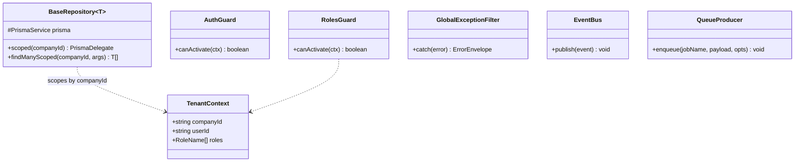

> Every controller is decorated with `@UseGuards(AuthGuard, RolesGuard)` and `@Roles(...)`.
> Every repository extends `BaseRepository` and never issues a query without `companyId`.
> Every service that causes a side effect calls `EventBus.publish` or `QueueProducer.enqueue`
> rather than performing the side effect inline.

---

## 5.1 Auth module

Owns identity, login, token issuance/rotation, RBAC and the password lifecycle.

### Class diagram

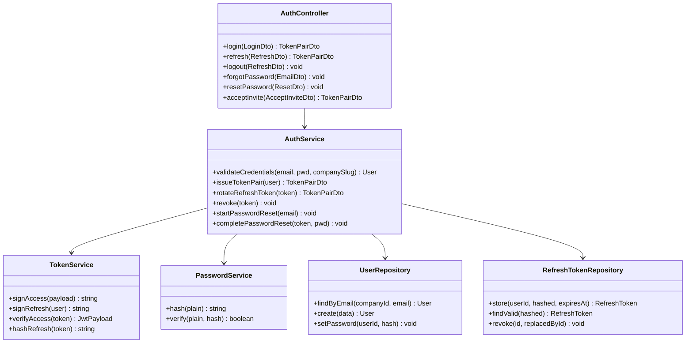

### Sequence — login with refresh-token rotation

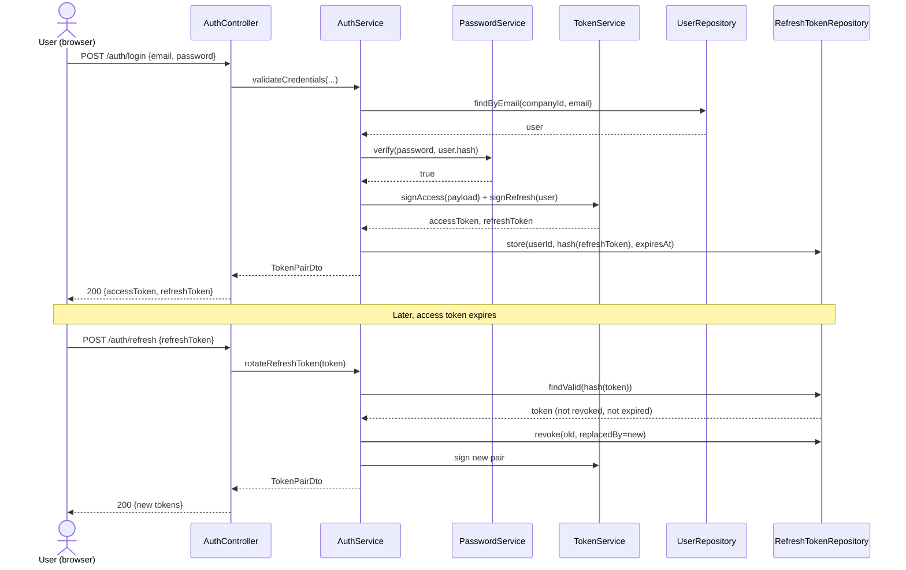

---

## 5.2 Company module

Owns the tenant, departments, designations, locations and company settings.

### Class diagram

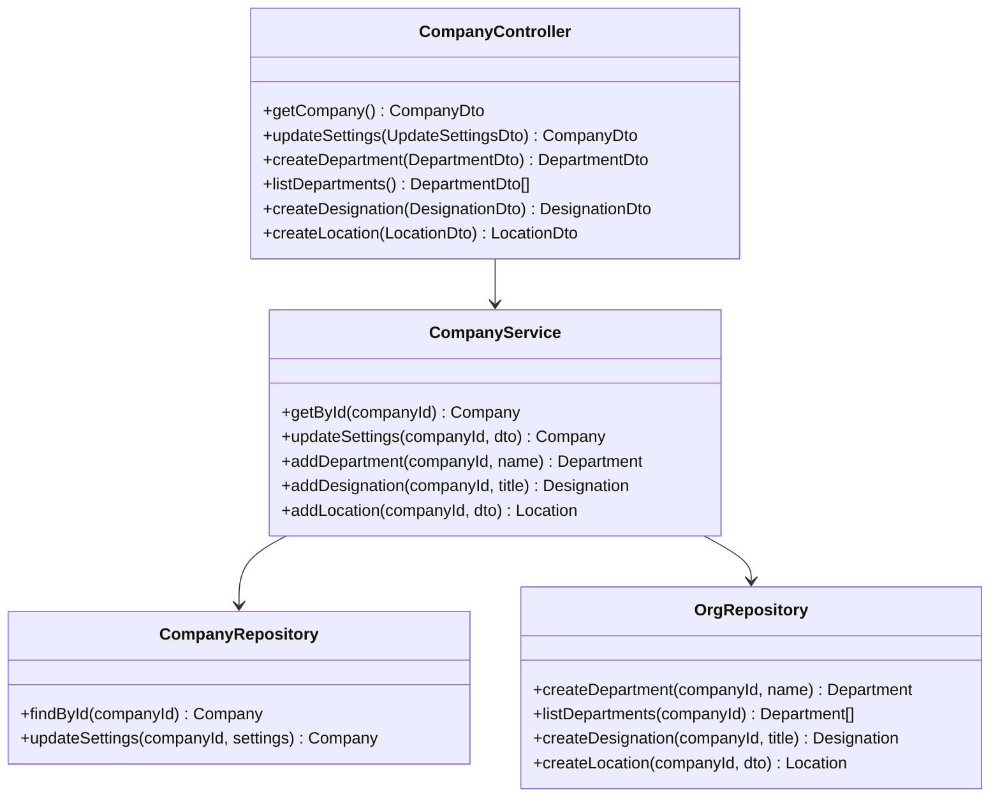

### Sequence — company onboarding (sign-up creates tenant + owner)

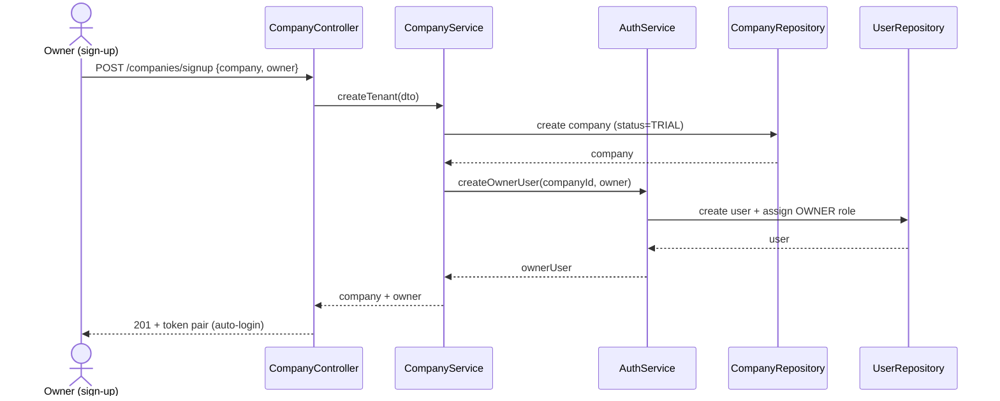

---

## 5.3 Employees module

The anchor context: employee records, employment, compensation and lifecycle.

### Class diagram

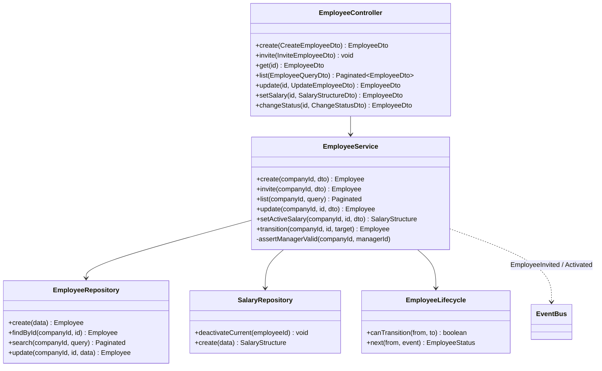

### Sequence — invite and onboard an employee

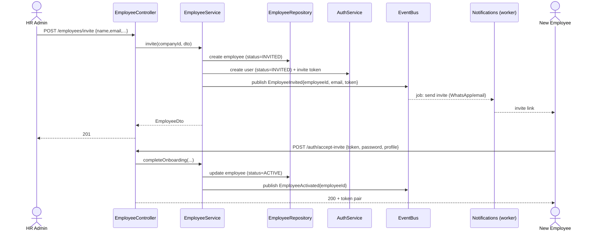

---

## 5.4 Attendance module

Daily attendance plus regularisation; produces the monthly summary payroll consumes.

### Class diagram

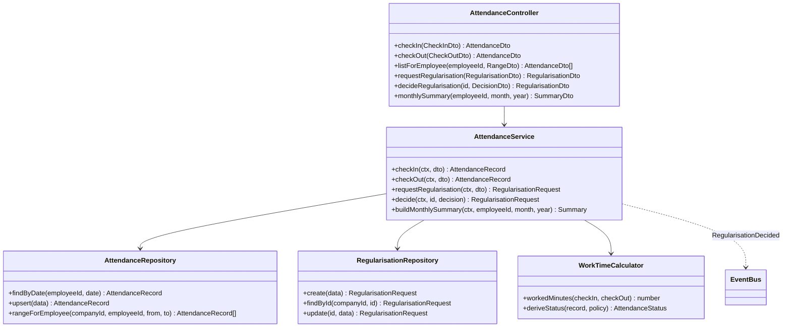

### Sequence — check-in / check-out

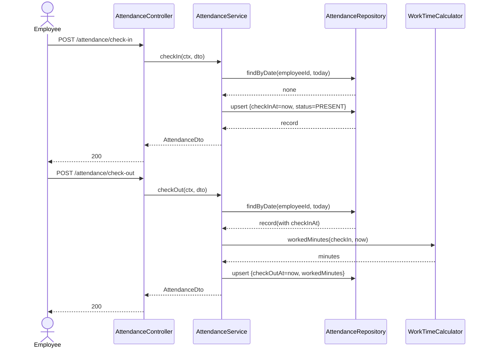

### Sequence — regularisation approval

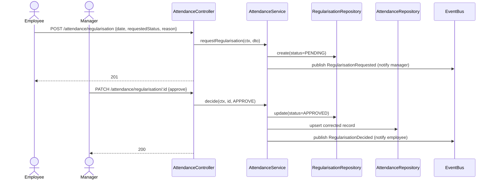

---

## 5.5 Leaves module

Leave types/policies, balances, and the apply → approve workflow with balance reservation.

### Class diagram

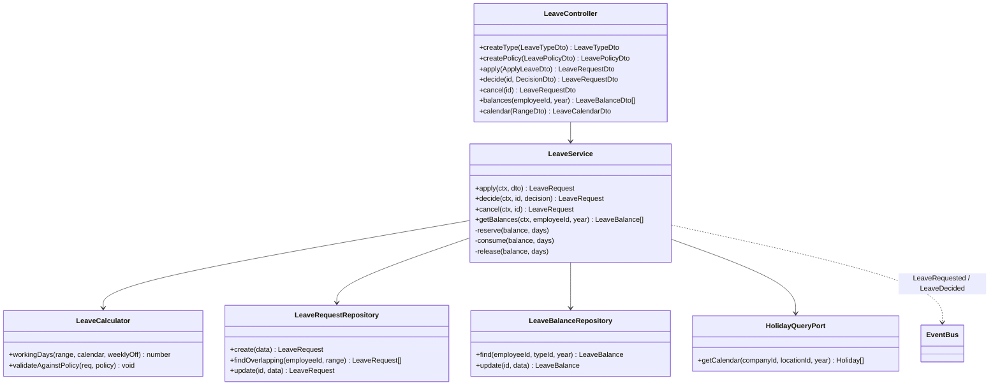

### Sequence — apply for leave (balance reserved, validated)

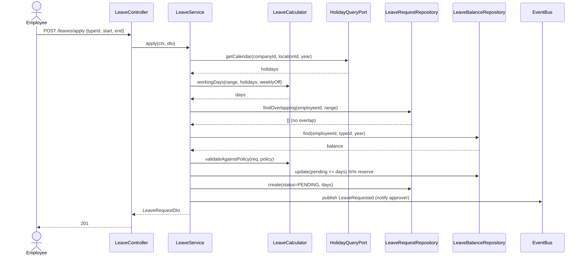

### Sequence — approve / reject leave

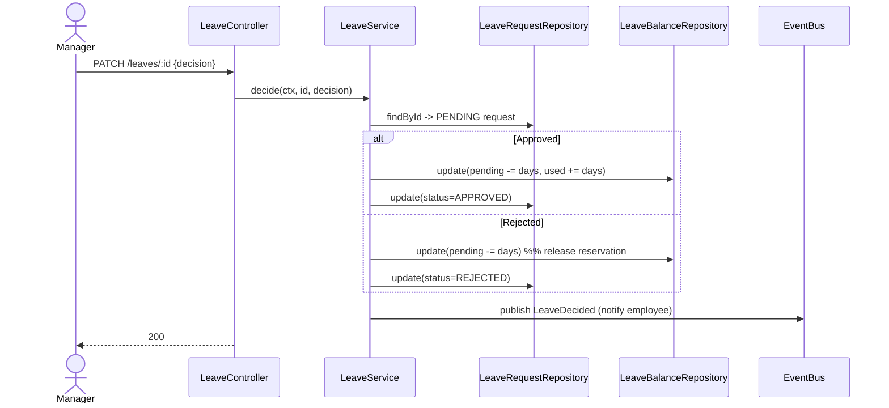

---

## 5.6 Holidays module

Calendars per company/location/year; a query port consumed by Leaves and Payroll.

### Class diagram

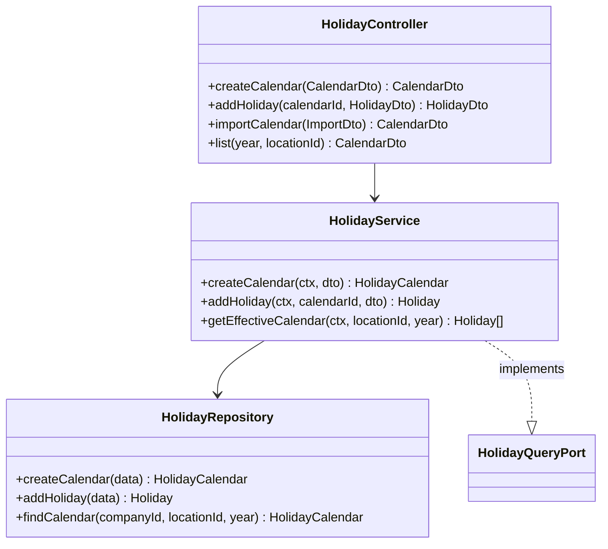

### Sequence — resolve effective calendar (location falls back to company default)

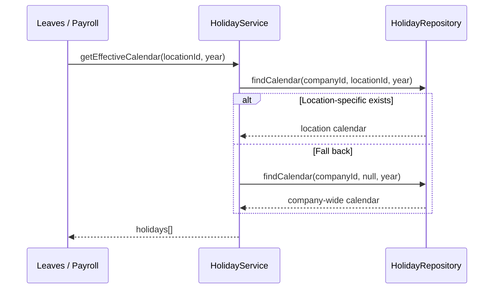

---

## 5.7 Payroll module

Runs payroll for a period, computes earnings/deductions and statutory components, and
produces payslip PDFs asynchronously.

### Class diagram

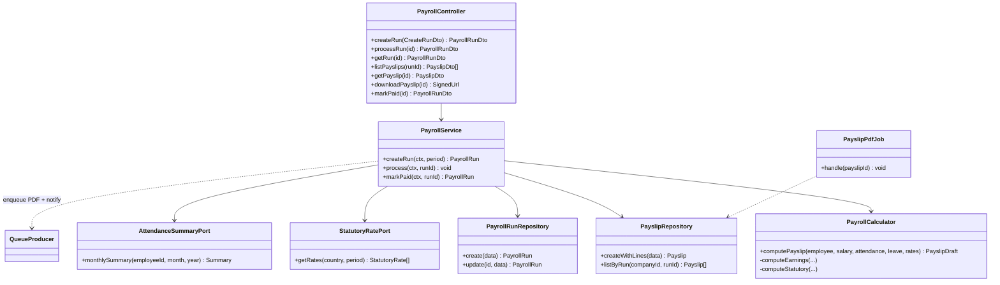

### Sequence — run payroll for a period (async, idempotent)

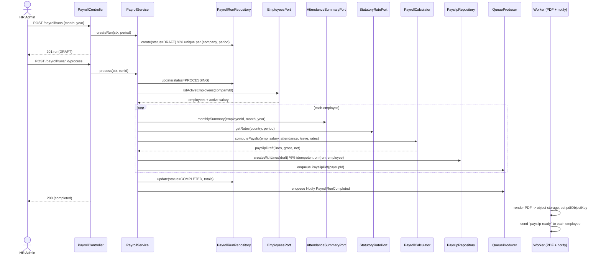

### Flow — statutory deduction calculation (decision flow)

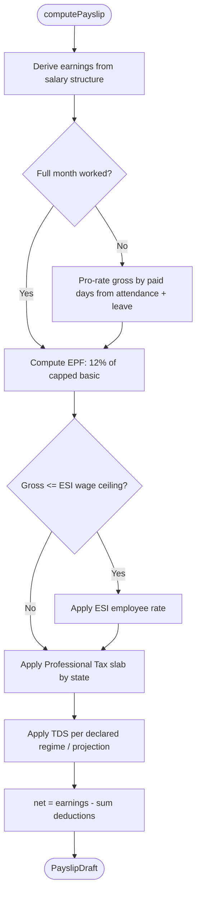

---

## 5.8 Notifications module

Renders templates and delivers WhatsApp/email via queues, with retry and idempotency.

### Class diagram

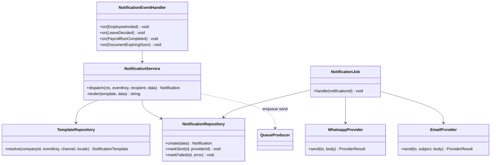

### Sequence — event to delivery with retry

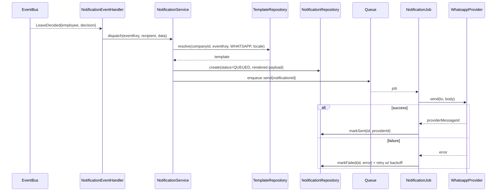

---

## 5.9 Documents module

Stores files in object storage, enforces access rules, and reminds before expiry.

### Class diagram

```mermaid
classDiagram
    class DocumentController {
        +requestUpload(UploadIntentDto) PresignedUploadDto
        +confirmUpload(ConfirmDto) DocumentDto
        +get(id) DocumentDto
        +download(id) SignedUrl
        +list(DocumentQueryDto) DocumentDto[]
        +delete(id) void
    }
    class DocumentService {
        +createUploadIntent(ctx, dto) PresignedUpload
        +confirmUpload(ctx, dto) Document
        +getDownloadUrl(ctx, id) string
        +list(ctx, query) Document[]
        +softDelete(ctx, id) void
        -assertCanAccess(ctx, doc)
    }
    class DocumentRepository {
        +create(data) Document
        +findById(companyId, id) Document
        +list(companyId, query) Document[]
        +findExpiring(companyId, before) Document[]
    }
    class ObjectStoragePort {
        +presignPut(key, mime) string
        +presignGet(key) string
        +exists(key) boolean
    }
    class ExpiryScanJob {
        +handle() void
    }
    DocumentController --> DocumentService
    DocumentService --> DocumentRepository
    DocumentService --> ObjectStoragePort
    DocumentService ..> EventBus : DocumentExpiringSoon
    ExpiryScanJob --> DocumentRepository
    ExpiryScanJob ..> EventBus
```

### Sequence — presigned upload then expiry reminder

```mermaid
sequenceDiagram
    actor A as HR Admin
    participant DC as DocumentController
    participant DS as DocumentService
    participant OS as ObjectStoragePort
    participant DR as DocumentRepository
    participant SC as ExpiryScanJob (scheduled)
    participant EB as EventBus

    A->>DC: POST /documents/upload-intent {title, mime, expiresAt}
    DC->>DS: createUploadIntent(ctx, dto)
    DS->>OS: presignPut(key, mime)
    OS-->>DS: presigned URL
    DS-->>A: {uploadUrl, objectKey}
    A->>OS: PUT file directly to storage
    A->>DC: POST /documents/confirm {objectKey}
    DC->>DS: confirmUpload(ctx, dto)
    DS->>OS: exists(key)?
    DS->>DR: create(metadata, expiresAt)
    DC-->>A: 201 DocumentDto

    Note over SC,EB: Daily scheduled scan
    SC->>DR: findExpiring(companyId, in 30 days)
    DR-->>SC: documents
    SC->>EB: publish DocumentExpiringSoon (per doc)
```

## 5.10 Cross-module flow — payroll month-end (composite)

To show how contexts collaborate, the end-to-end month-end flow ties Attendance, Leaves,
Holidays, Payroll, Documents and Notifications together.

```mermaid
sequenceDiagram
    actor A as HR Admin
    participant Pay as Payroll
    participant Att as Attendance
    participant Lv as Leaves
    participant Hol as Holidays
    participant Doc as Documents
    participant Ntf as Notifications

    A->>Pay: process run (month)
    Pay->>Att: monthly summaries (paid days)
    Pay->>Lv: approved leave in period
    Pay->>Hol: holidays in period
    Pay->>Pay: compute payslips (+ statutory)
    Pay->>Doc: archive payslip PDFs
    Pay->>Ntf: PayrollRunCompleted (notify employees)
    Ntf-->>A: run summary, employees get payslip-ready message
```
