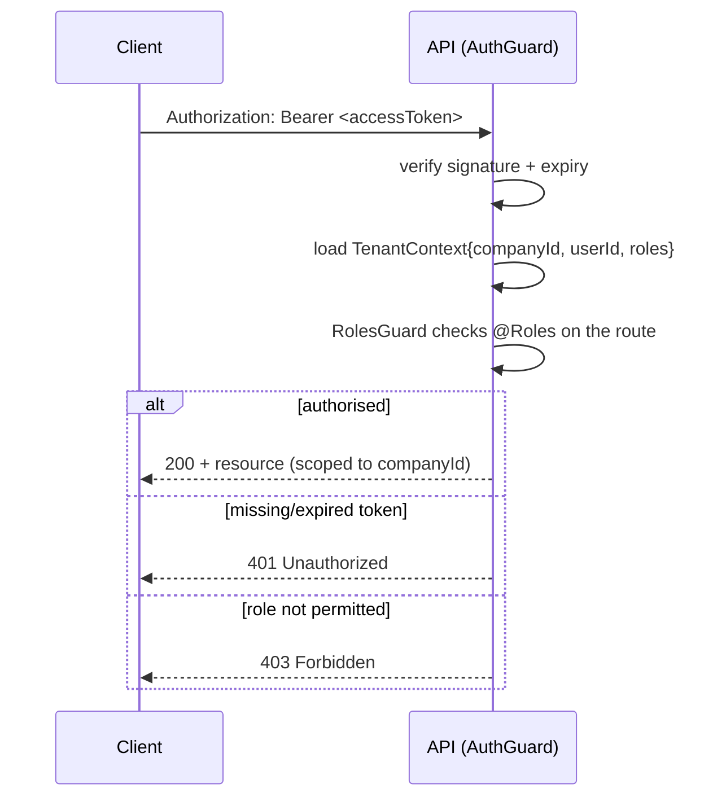

# 06 — API Design

This document defines the HTTP API: conventions, authentication, the error model,
pagination and filtering, and an endpoint catalog per module. The API is REST over JSON,
documented automatically with **OpenAPI / Swagger** generated from the NestJS DTOs, so the
contract here and the live `/docs` endpoint never drift.

## 6.1 Conventions

- **Base path & versioning**: all endpoints are under `/api/v1`. The major version is in the
  path; breaking changes bump it. Non-breaking additions (new fields, new endpoints) do not.
- **Resources are plural nouns**: `/employees`, `/leave-requests`, `/payroll/runs`.
- **HTTP methods**: `GET` (read), `POST` (create / action), `PATCH` (partial update),
  `PUT` (full replace, rarely used), `DELETE` (soft delete).
- **Actions that are not pure CRUD** are sub-resources or verbs scoped to a resource, e.g.
  `POST /payroll/runs/:id/process`, `PATCH /leave-requests/:id` with a decision body,
  `POST /attendance/check-in`.
- **Tenancy is implicit**: the `companyId` always comes from the authenticated token, never
  from the URL or body. A client cannot act on another tenant by changing a parameter.
- **Timestamps** are ISO-8601 UTC. **Dates** (no time) are `YYYY-MM-DD`. **Money** is
  returned as integer minor units plus a `currency` field on the envelope where relevant.
- **IDs** are UUID strings.
- **Idempotency**: state-changing operations that must not double-apply (payroll process,
  notification dispatch) accept an `Idempotency-Key` header.

## 6.2 Authentication & authorisation



- **Access token**: short-lived JWT (e.g. 15 min) sent as `Authorization: Bearer`.
- **Refresh token**: long-lived, rotated on use, sent only to `/auth/refresh`; stored by the
  client in an httpOnly cookie or secure storage.
- **Roles**: `OWNER`, `HR_ADMIN`, `MANAGER`, `EMPLOYEE`. Routes declare required roles with
  `@Roles(...)`. Resource-level checks (e.g. a manager can only decide leave for their own
  reports; an employee can only read their own payslip) are enforced in the service layer.

## 6.3 Standard response envelopes

Success (single resource):

```json
{ "data": { "id": "…", "…": "…" } }
```

Success (collection, paginated):

```json
{
  "data": [ { "id": "…" } ],
  "meta": { "page": 1, "pageSize": 20, "total": 137, "totalPages": 7 }
}
```

Error (consistent shape from the global exception filter):

```json
{
  "error": {
    "code": "LEAVE_INSUFFICIENT_BALANCE",
    "message": "Not enough Casual Leave balance for the requested dates.",
    "details": [ { "field": "days", "issue": "requested 3, available 1.5" } ],
    "requestId": "req_01H...",
    "timestamp": "2026-06-05T10:00:00Z"
  }
}
```

## 6.4 Error model

| HTTP | When | Example `code` |
|------|------|----------------|
| 400 | Validation failed (DTO) | `VALIDATION_FAILED` |
| 401 | Missing/invalid/expired token | `UNAUTHENTICATED` |
| 403 | Authenticated but not permitted | `FORBIDDEN` |
| 404 | Resource not found in this tenant | `NOT_FOUND` |
| 409 | Conflict / invariant violation | `LEAVE_OVERLAP`, `PAYROLL_RUN_EXISTS` |
| 422 | Domain rule rejected the request | `LEAVE_INSUFFICIENT_BALANCE` |
| 429 | Rate limit exceeded | `RATE_LIMITED` |
| 500 | Unexpected error (logged to Sentry) | `INTERNAL_ERROR` |

Domain-specific codes are stable strings the frontend can branch on without parsing prose;
`message` is human-readable and localisable.

## 6.5 Pagination, filtering, sorting

- **Pagination**: `?page=1&pageSize=20` (page-based; `pageSize` capped at 100). Cursor
  pagination is reserved for high-volume endpoints (attendance, audit logs) via `?cursor=`.
- **Filtering**: explicit query params per endpoint, e.g.
  `GET /leave-requests?status=PENDING&employeeId=…&from=2026-06-01&to=2026-06-30`.
- **Sorting**: `?sort=field` / `?sort=-field` (prefix `-` = descending). Allowed sort fields
  are whitelisted per endpoint.
- **Sparse fields / expansion** (optional): `?expand=department,designation` to embed
  related resources where it avoids N+1 client calls.

## 6.6 Endpoint catalog

Roles in the table are the **minimum** required; higher roles inherit access. "Self" means
the resource must belong to the calling employee unless the role is HR_ADMIN/OWNER.

### Auth

| Method | Path | Roles | Purpose |
|--------|------|-------|---------|
| POST | `/auth/login` | public | Authenticate, get token pair |
| POST | `/auth/refresh` | public (valid refresh) | Rotate tokens |
| POST | `/auth/logout` | any | Revoke refresh token |
| POST | `/auth/forgot-password` | public | Start password reset |
| POST | `/auth/reset-password` | public (valid token) | Complete reset |
| POST | `/auth/accept-invite` | public (valid invite) | Set password, activate |
| GET | `/auth/me` | any | Current user + roles + employee link |

### Company & org

| Method | Path | Roles | Purpose |
|--------|------|-------|---------|
| POST | `/companies/signup` | public | Create tenant + owner |
| GET | `/company` | EMPLOYEE | Get current company |
| PATCH | `/company/settings` | HR_ADMIN | Update settings |
| GET/POST | `/departments` | EMPLOYEE / HR_ADMIN | List / create |
| GET/POST | `/designations` | EMPLOYEE / HR_ADMIN | List / create |
| GET/POST | `/locations` | EMPLOYEE / HR_ADMIN | List / create |

### Employees

| Method | Path | Roles | Purpose |
|--------|------|-------|---------|
| GET | `/employees` | MANAGER | List/search (managers see reports; HR sees all) |
| POST | `/employees` | HR_ADMIN | Create record |
| POST | `/employees/invite` | HR_ADMIN | Invite + send onboarding |
| GET | `/employees/:id` | Self / MANAGER / HR_ADMIN | Get profile |
| PATCH | `/employees/:id` | Self (limited) / HR_ADMIN | Update profile |
| PUT | `/employees/:id/salary` | HR_ADMIN | Set active salary structure |
| PATCH | `/employees/:id/status` | HR_ADMIN | Lifecycle transition |

### Attendance

| Method | Path | Roles | Purpose |
|--------|------|-------|---------|
| POST | `/attendance/check-in` | EMPLOYEE | Check in today |
| POST | `/attendance/check-out` | EMPLOYEE | Check out today |
| GET | `/attendance` | Self / MANAGER / HR_ADMIN | Records by range/employee |
| GET | `/attendance/summary` | Self / MANAGER / HR_ADMIN | Monthly summary |
| POST | `/attendance/regularisations` | EMPLOYEE | Request correction |
| PATCH | `/attendance/regularisations/:id` | MANAGER | Approve/reject |

### Leaves & holidays

| Method | Path | Roles | Purpose |
|--------|------|-------|---------|
| GET/POST | `/leave-types` | EMPLOYEE / HR_ADMIN | List / create |
| GET/POST | `/leave-policies` | EMPLOYEE / HR_ADMIN | List / create |
| POST | `/leave-requests` | EMPLOYEE | Apply for leave |
| GET | `/leave-requests` | Self / MANAGER / HR_ADMIN | List/filter |
| PATCH | `/leave-requests/:id` | MANAGER | Approve/reject |
| POST | `/leave-requests/:id/cancel` | Self | Cancel |
| GET | `/leave-balances` | Self / MANAGER / HR_ADMIN | Balances by year |
| GET | `/leaves/calendar` | EMPLOYEE | Team/company leave calendar |
| GET/POST | `/holiday-calendars` | EMPLOYEE / HR_ADMIN | List / create |
| POST | `/holiday-calendars/:id/holidays` | HR_ADMIN | Add holiday |

### Payroll

| Method | Path | Roles | Purpose |
|--------|------|-------|---------|
| POST | `/payroll/runs` | HR_ADMIN | Create a run (DRAFT) |
| POST | `/payroll/runs/:id/process` | HR_ADMIN | Process (idempotent) |
| GET | `/payroll/runs` | HR_ADMIN | List runs |
| GET | `/payroll/runs/:id` | HR_ADMIN | Run detail + totals |
| POST | `/payroll/runs/:id/mark-paid` | HR_ADMIN | Mark disbursed |
| GET | `/payroll/runs/:id/payslips` | HR_ADMIN | Payslips in run |
| GET | `/payslips` | Self / HR_ADMIN | List own/all payslips |
| GET | `/payslips/:id` | Self / HR_ADMIN | Payslip detail |
| GET | `/payslips/:id/download` | Self / HR_ADMIN | Signed PDF URL |

### Documents

| Method | Path | Roles | Purpose |
|--------|------|-------|---------|
| POST | `/documents/upload-intent` | EMPLOYEE | Get presigned upload URL |
| POST | `/documents/confirm` | EMPLOYEE | Confirm + persist metadata |
| GET | `/documents` | Self / HR_ADMIN (by access level) | List |
| GET | `/documents/:id/download` | per access level | Signed download URL |
| DELETE | `/documents/:id` | HR_ADMIN / owner | Soft delete |

### Notifications & platform

| Method | Path | Roles | Purpose |
|--------|------|-------|---------|
| GET | `/notifications` | HR_ADMIN | Delivery log/status |
| GET/PUT | `/notification-templates` | HR_ADMIN | Manage templates |
| GET | `/audit-logs` | OWNER / HR_ADMIN | Audit trail (cursor-paginated) |
| GET | `/dashboard/summary` | MANAGER / HR_ADMIN | Headcount, attendance, leave, cost |
| GET | `/health` / `/ready` | public | Liveness / readiness probes |

## 6.7 Validation & contracts

- Every request body is a **DTO** decorated with `class-validator`. The global
  `ValidationPipe` runs in `whitelist + forbidNonWhitelisted + transform` mode: unknown
  fields are rejected, types are coerced, and validation failures return `400` with a
  per-field `details` array.
- The **same Zod schemas** used in the frontend (`React Hook Form + Zod`) mirror the DTOs;
  a shared `@waailo/contracts` package can hold the types so the client and server agree at
  compile time.
- Swagger is served at `/api/v1/docs`; the OpenAPI JSON at `/api/v1/docs-json` is committed
  to `docs/openapi.json` on release so the contract is versioned alongside the code.

## 6.8 Rate limiting & abuse protection

- Auth endpoints (`/auth/login`, `/auth/forgot-password`) are throttled per IP and per
  account to slow credential stuffing.
- Write endpoints have a per-user throttle; bulk endpoints (imports) require HR_ADMIN and
  run via background jobs rather than synchronous requests.
- All endpoints enforce the tenant scope, so even an authenticated user cannot enumerate or
  mutate another company's data.
