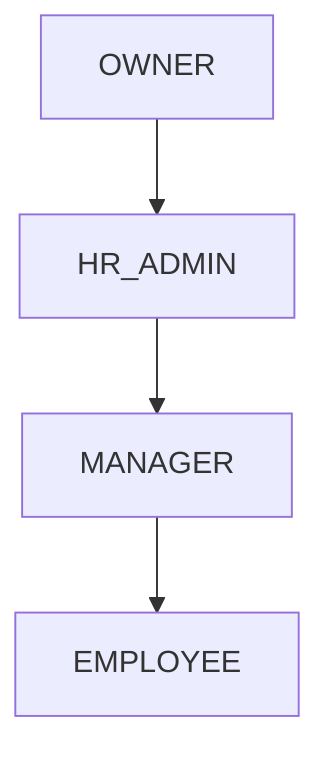
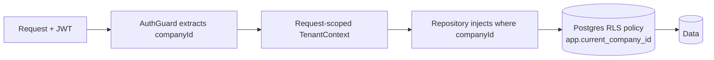

# 07 — Security & Compliance

This document covers authentication and authorisation, multi-tenant isolation, data
protection, audit, and the statutory/regulatory obligations for an HR & payroll product
operating in India with an eye to GDPR for any EU users.

## 7.1 Authentication

- **Password storage**: hashed with **argon2id** (or bcrypt with a high cost factor). Plain
  passwords are never logged or stored.
- **Tokens**: stateless **JWT access tokens** (short TTL, ~15 min) carry `sub` (userId),
  `companyId`, and `roles`. **Refresh tokens** are long-lived, stored **hashed** in
  `refresh_tokens`, and **rotated** on every use; the old token is revoked and linked via
  `replaced_by`. Reuse of a revoked refresh token invalidates the whole token family
  (theft detection).
- **Session controls**: logout revokes the presented refresh token; an admin can revoke all
  of a user's tokens (e.g. on offboarding). Token signing keys are loaded from secrets and
  rotated periodically with a key id (`kid`) in the JWT header.
- **Invite & reset flows** use single-use, time-boxed, hashed tokens delivered out-of-band
  (email/WhatsApp); they never reveal whether an email exists (uniform responses).

## 7.2 Authorisation (RBAC)

Four roles with increasing privilege. Authorisation is enforced in two places: route guards
for coarse access, and service-layer checks for resource ownership.



| Role | Can do |
|------|--------|
| **OWNER** | Everything HR_ADMIN can, plus billing, company deletion, audit access, role grants |
| **HR_ADMIN** | Manage employees, payroll, leave/holiday config, documents, templates |
| **MANAGER** | View their reports; approve/reject their reports' leave & regularisations |
| **EMPLOYEE** | Self-service: own attendance, leave, payslips, documents, profile |

Resource-level rules enforced in services (not just guards):

- A MANAGER may only act on requests where the subject employee's `managerId` is them.
- An EMPLOYEE may only read/write their own records (`employee.userId === ctx.userId`).
- Payslips, salary and statutory IDs are readable only by the owner and HR_ADMIN/OWNER.

## 7.3 Multi-tenant isolation (defence in depth)

As introduced in [document 02](./02-high-level-architecture.md) §2.6, isolation is enforced
at three layers:



1. **Application context** — `companyId` derived only from the verified JWT, never from
   client input.
2. **Repository scoping** — a `BaseRepository` exposes only company-scoped helpers; a custom
   ESLint rule and code review forbid raw Prisma calls that omit `companyId`.
3. **Database RLS (backstop)** — each connection sets `SET app.current_company_id = $cid`;
   RLS policies on tenant tables restrict rows to that company even if application code has
   a bug. Example policy intent:

   ```sql
   ALTER TABLE employees ENABLE ROW LEVEL SECURITY;
   CREATE POLICY tenant_isolation ON employees
     USING (company_id = current_setting('app.current_company_id')::uuid);
   ```

Cross-tenant tests assert that a token for company A cannot read or mutate company B's rows
under any endpoint.

## 7.4 Data protection

- **Encryption in transit**: TLS everywhere (frontend↔API, API↔DB, API↔providers).
- **Encryption at rest**: managed Postgres and object storage encrypt at rest. Additionally,
  **application-level encryption** is applied to the most sensitive fields — bank account,
  PAN/Aadhaar reference, ESI/UAN — using an envelope-encryption scheme (a KMS-held data key);
  these columns store ciphertext and are decrypted only when needed by authorised flows.
- **PII minimisation in logs**: structured logs carry ids, not values; a redaction layer
  strips known PII fields. Sentry is configured to scrub request bodies and headers.
- **Object storage access** is never public; files are served via short-lived **presigned
  URLs** scoped to a single object and verb.
- **Backups** are encrypted, access-controlled, and tested by periodic restore drills.

## 7.5 Audit trail

Critical actions (create/update/delete of employees, salary changes, payroll runs, role
grants, document deletes, login events) are recorded in append-only `audit_logs` with actor,
action, entity, before/after diff, IP and timestamp. The log is queryable by OWNER/HR_ADMIN
and is itself immutable (no update/delete endpoints). This supports both security forensics
and the accountability principle of data-protection law.

## 7.6 GDPR & privacy (for EU users)

Even though the launch market is India, the data model and processes are built to satisfy
GDPR so EU customers are not blocked later.

| Principle | Implementation |
|-----------|----------------|
| **Lawful basis** | Employment contract / legitimate interest; documented per data category |
| **Data minimisation** | Only fields needed for HR/payroll are collected |
| **Right of access / portability** | Export-employee endpoint produces a machine-readable bundle of a data subject's records |
| **Right to rectification** | Self-service + HR edit flows, audited |
| **Right to erasure** | Off-boarding workflow soft-deletes then hard-deletes after the legal retention window, preserving only what statute requires |
| **Storage limitation** | Retention policy per entity (e.g. payroll records kept per Indian law; other PII purged on schedule) |
| **Processor obligations** | Sub-processors (WhatsApp, email, storage) are listed; DPAs in place; data residency configurable |
| **Breach readiness** | Audit + monitoring enable the 72-hour notification obligation |

A **Data Processing Inventory** (which fields, why, where stored, who can access, retention)
is maintained alongside this document and reviewed when the schema changes.

## 7.7 Indian labour-law / statutory compliance

Payroll must compute and report statutory components correctly; rates are stored in the
global `statutory_rates` table with effective dates so the system adapts when rules change
without code changes.

| Component | What it is | Design note |
|-----------|-----------|-------------|
| **EPF** (Employees' Provident Fund) | Retirement contribution, employee + employer share on (capped) basic wages | Rate & wage ceiling held in `statutory_rates`; UAN stored per employee (encrypted) |
| **ESI** (Employees' State Insurance) | Health insurance contribution below a wage ceiling | Applied only when gross ≤ ceiling; ESI number stored per employee |
| **Professional Tax (PT)** | State-level tax on income; slabs vary by state | Slab table keyed by state in `statutory_rates`; resolved by employee location |
| **TDS** (Tax Deducted at Source) | Income-tax withholding per regime/projection | v1 supports a simplified projection; designed to plug in a fuller engine later |
| **Gratuity / Bonus** (future) | Tenure/profit-based statutory payments | Modelled as future earning types; not in v1 |

Design principles for compliance:

- **No hard-coded rates** — every statutory rate, slab and ceiling lives in versioned data
  with `effectiveFrom`/`effectiveTo`, so a budget change is a data update, not a deploy.
- **Deterministic, auditable calculation** — `PayrollCalculator` is pure and unit-tested
  against a reference set; each payslip line records whether it is statutory and which rate
  version produced it (for audit).
- **Configurability** — companies in different states automatically get the right PT slab
  via their location; the model does not assume a single state.

> The system provides the calculations and records; it is not a substitute for professional
> tax/legal advice, and customers remain responsible for their statutory filings.

## 7.8 Third-party licensing & dependencies

- All runtime dependencies are open-source under permissive licences (MIT/Apache/BSD);
  copyleft (GPL/AGPL) libraries are avoided for the distributed product unless isolated.
- A dependency manifest and licence report are generated in CI; new dependencies are
  reviewed for licence compatibility and known vulnerabilities (SCA scanning).
- Secrets are never committed; `.env.example` documents required variables without values.

## 7.9 Security testing & hardening checklist

- Automated dependency and container scanning in CI.
- Authn/z tests including cross-tenant access attempts and privilege-escalation attempts.
- Input validation on every DTO; output encoding on the frontend to prevent XSS.
- Parameterised queries only (Prisma) — no string-built SQL — preventing injection.
- Rate limiting and account lockout on auth endpoints.
- Security headers (HSTS, CSP, X-Content-Type-Options) on the frontend and API.
- Periodic penetration testing before major releases; findings tracked to closure.
