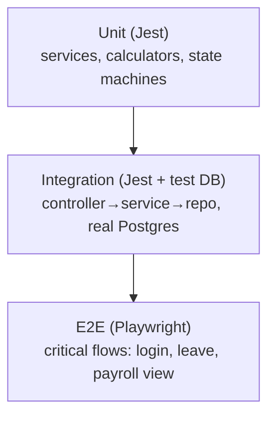
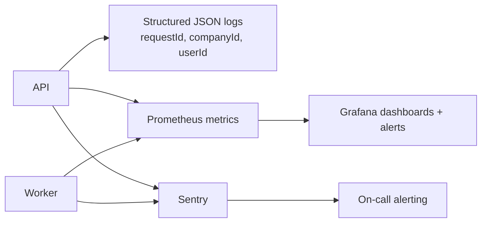

# 08 — Non-Functional Requirements & Observability

This document sets the performance targets, the caching and queueing strategy, the testing
strategy, and the observability/operations approach that every module is built against.

## 8.1 Performance targets (SLOs)

Targets are for the expected SMB scale (companies of 10–500 employees; low hundreds of
tenants on shared infrastructure).

| Area | Target |
|------|--------|
| Read API latency (p95) | < 300 ms |
| Write API latency (p95) | < 500 ms |
| Auth (login/refresh) p95 | < 400 ms |
| Dashboard summary p95 | < 800 ms (cached) |
| Payroll run for 100 employees | < 60 s end-to-end (async) |
| Payslip PDF generation per slip | < 2 s (worker) |
| Notification dispatch latency | < 30 s from event to send attempt |
| Availability (API) | 99.9% monthly |
| Error rate (5xx) | < 0.1% of requests |

These are encoded as alert thresholds in monitoring (§8.6) so regressions are caught.

## 8.2 Caching strategy

Redis backs both queues and a read cache. Cached data is hot, read-heavy and tolerant of a
few seconds' staleness; everything is invalidated on the corresponding write.

| Cached read | TTL | Invalidated on |
|-------------|-----|----------------|
| Current user + roles (`/auth/me`) | 5 min | role/profile change |
| Company settings, departments, designations, locations | 10 min | org edits |
| Holiday calendar for a year | 1 h | holiday edits |
| Leave balances (per employee/year) | 1 min | leave decision/cancel |
| Dashboard summary aggregates | 2 min | scheduled refresh + key writes |

Principles: cache **derived/aggregated** reads, never write through the cache; use
versioned cache keys (`company:{id}:settings:v3`) so a deploy can bust stale shapes; keep
authoritative state in Postgres.

## 8.3 Background jobs & queues

Slow or external work runs on the **Worker** via BullMQ queues so HTTP stays fast.

| Queue | Producer | Job | Retry policy |
|-------|----------|-----|--------------|
| `notifications` | event handlers | send WhatsApp/email | exp. backoff, max 5, dead-letter |
| `payroll` | PayrollService | compute payslips, generate PDFs | backoff, idempotent per (run, employee) |
| `documents` | scheduler | daily expiry scan | retry on transient failure |
| `scheduled` | cron | accrual run, birthdays/anniversaries, summary refresh | idempotent per period |

Job guarantees:

- **Idempotency** — every job is safe to run twice (keyed by event/entity id), because
  at-least-once delivery can replay jobs.
- **Backoff + dead-letter** — failures retry with exponential backoff; exhausted jobs land
  in a dead-letter queue with the error for inspection.
- **Visibility** — job counts, latencies and failures are exported as metrics.

## 8.4 Database performance

- Composite indexes lead with `company_id` on hot paths (see
  [document 04](./04-database-schema.md) §4.4).
- N+1 queries are avoided by Prisma `include`/`select` and, where needed, explicit batched
  queries; the code-review checklist flags loops that query per-iteration.
- Connection pooling (PgBouncer or the platform's pooler) caps connections from horizontally
  scaled API/worker instances.
- The fastest-growing tables (`attendance_records`, `audit_logs`) are candidates for monthly
  range partitioning once volume warrants; queries already include the partition key (date).

## 8.5 Testing strategy (quality gates)

A layered test pyramid; CI blocks merges that fail any gate.

| Level | Tooling | Scope |
|-------|---------|-------|
| **Unit** | Jest | Pure domain logic: `PayrollCalculator`, `LeaveCalculator`, lifecycle state machines, mappers. Fast, mocked repositories. |
| **Integration** | Jest + ephemeral Postgres (Testcontainers/docker-compose) | Controller→service→repository against a real DB, including tenancy scoping and transactions |
| **E2E** | Playwright | Critical user journeys through the real frontend + API: login, apply/approve leave, run & view payroll, upload document |
| **Contract** | OpenAPI snapshot | Detects unintended API changes |
| **Load** | k6 / Artillery | Concurrency on auth, attendance check-in spikes, payroll runs |

Quality gates in CI: ESLint + Prettier check, TypeScript `--noEmit`, unit+integration tests,
coverage threshold (e.g. 80% lines on the domain layers, with payroll/leave calculators held
to a higher bar), and a successful build of both services.

## 8.6 Observability

- **Logging** — structured JSON with a correlation `requestId` propagated through services
  and into job payloads; no PII (see [document 07](./07-security-compliance.md) §7.4).
- **Metrics** — RED metrics (Rate, Errors, Duration) per endpoint; queue depth/latency;
  payroll run duration; DB pool saturation; cache hit ratio. Visualised in Grafana.
- **Error tracking** — Sentry on frontend and backend, releases tagged so regressions map to
  a deploy.
- **Health** — `/health` (liveness) and `/ready` (readiness: DB + Redis reachable) drive
  rolling deploys and load-balancer checks.
- **Alerting** — SLO-based alerts (latency p95, 5xx rate, queue backlog, failed payroll
  jobs) page the on-call; runbooks accompany each alert.

## 8.7 Analytics & instrumentation

- Product usage events (employee invited, leave applied, payroll run, self-service login)
  are emitted to an analytics pipeline (Segment or self-hosted) to measure the success
  metrics in [document 01](./01-product-overview.md) §1.6.
- Events carry pseudonymous ids, never raw PII, and respect tenant boundaries.
- A small set of north-star dashboards (activation, self-service adoption, payroll cycle
  time) is maintained for the product team.

## 8.8 Capacity & scaling plan

- **Vertical first**: the modular monolith scales comfortably by adding API/worker replicas
  and a larger managed Postgres before any decomposition.
- **Extract when needed**: if notifications or payroll become hotspots, they are the
  pre-identified extraction candidates (already isolated behind ports/events), and can run
  as separate services without a data-model rewrite.
- **Tenant growth**: shared-schema multi-tenancy supports many small tenants cheaply; a very
  large tenant can be moved to a dedicated database using the same schema if required.
