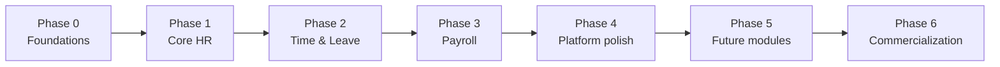

# 09 — Roadmap & Delivery Plan

This document sequences the build into phases, lists the future modules, and records
architecture decisions and changes so the design and the code stay in sync over time.

## 9.1 Delivery phases

The phasing front-loads the foundations (tenancy, auth, employees) that every later module
depends on, then delivers operational value module by module.

### Phase 0 — Foundations

Repo scaffold (monorepo: NestJS API + worker, Next.js app), Docker/compose for Postgres &
Redis, Prisma schema + first migration + seeds, CI quality gates (lint, type-check, test),
shared building blocks (TenantContext, BaseRepository, guards, global exception filter,
event bus/queue wiring), and the design system foundation (tokens, base components).

**Exit criteria**: a developer can clone, `docker compose up`, run migrations/seeds, and hit
a health-checked API with auth scaffolding and an empty but styled frontend shell.

### Phase 1 — Core HR

Auth (login, refresh rotation, invites, reset), Company & org structure, Employees (records,
salary structure, lifecycle), Documents (upload/access/expiry), and the admin dashboard
skeleton + employee self-service shell.

**Exit criteria**: an admin can onboard a company, invite and manage employees, and store
documents; employees can log in and see/update their profile.

### Phase 2 — Time & Leave

Attendance (check-in/out, regularisation, monthly summary), Holidays (calendars), Leaves
(types, policies, balances, apply→approve, calendar), Notifications (WhatsApp/email via
queues) wired to leave and regularisation events.

**Exit criteria**: employees mark attendance and apply for leave; managers approve;
balances and calendars are correct; both parties are notified.

### Phase 3 — Payroll

Payroll runs, statutory rate tables + calculations (EPF/ESI/PT/TDS basic), payslip generation
(PDF to object storage), payslip viewing/download, payroll notifications, and the cost view
on the dashboard.

**Exit criteria**: an admin runs monthly payroll for a 100-person company in under 15
minutes; payslips are accurate against the reference set; employees download payslips.

### Phase 4 — Platform polish

Performance & load testing to the SLOs in [document 08](./08-nfr-observability.md),
accessibility audit (WCAG 2.1 AA) and responsive pass, observability dashboards + alerting,
hardening (RLS, rate limits, security tests), and documentation completion
(README, runbooks, OpenAPI export).

**Exit criteria**: SLOs met under load tests; accessibility and security checklists green;
on-call runbooks in place.

### Phase 5+ — Future modules

See §9.2.

### Phase 6 — Commercialization (SaaS productization)

Turn the multi-tenant app into a sellable SaaS: subscription **billing** (per-seat plans,
recurring collection), **plan enforcement** (seat limits + feature flags), production
**hardening** (RLS, rate limiting, real S3 + email/WhatsApp providers), and the **commercial
surface** (pricing page, billing settings, customer portal). Payment strategy is
**Razorpay Subscriptions for India first**, adding a **Merchant of Record** (Paddle/Dodo) for
international customers later. Full design in
[document 13](./13-saas-commercialization-and-billing.md).

**Exit criteria**: a company can pick a plan, pay via Razorpay (UPI Autopay / card e-mandate),
and have paid features unlocked automatically via verified webhooks; seat limits enforce; the
billing portal lets them manage/cancel.

## 9.2 Future modules

| Module | Summary | Notes on fit with current design |
|--------|---------|----------------------------------|
| **Recruitment / ATS** | Job openings, candidates, interview pipeline, offers | New bounded context; converts a hired candidate into an `EmployeeInvited` event |
| **Performance management** | Goals/OKRs, review cycles, 360 feedback, ratings | New context referencing `employeeId`; feeds future compensation reviews |
| **AI assistant** | Natural-language HR queries, policy answers, draft messages, anomaly flags | Reads via existing service ports; sensitive data access governed by the same RBAC |
| **Mobile app** | Native attendance, leave, payslips, push notifications | Reuses the same REST API; notifications gain a push channel |
| **Advanced analytics** | Attrition, cost trends, diversity (where lawful) reporting | Consumes the analytics event stream + read replicas |
| **Multi-currency / multi-country payroll** | Beyond India | Statutory engine already data-driven; add country rate tables and currency handling |
| **Biometric / hardware attendance** | Device integrations | `AttendanceSource.BIOMETRIC` and an import port already in the model |
| **Billing & subscriptions** | Per-seat plans, recurring collection, plan gating, billing portal | New `BillingModule` + `Plan`/`Subscription` tables hanging off `companyId`; Razorpay-first, MoR later. See [document 13](./13-saas-commercialization-and-billing.md) |

## 9.3 Cross-cutting workstreams (run throughout)

- **Testing** evolves with each module (unit → integration → E2E); coverage gates enforced.
- **Security & compliance** reviewed each phase; Data Processing Inventory updated on schema
  changes.
- **Technical debt** tracked in a backlog with periodic refactoring slots; code audits each
  phase keep the modules clean and the boundaries intact.
- **Documentation** kept current: when a decision changes, update the relevant doc and add a
  changelog entry below.

## 9.4 Risks & mitigations

| Risk | Impact | Mitigation |
|------|--------|------------|
| Statutory rules change (EPF/ESI/PT/TDS) | Wrong payroll | Rates are versioned data, not code; reference-set tests; advisory disclaimer |
| Multi-tenant data leak | Severe (trust/legal) | Defence-in-depth isolation + cross-tenant tests + RLS backstop |
| Notification provider limits/outages | Missed messages | Queue retries, dead-letter, multi-provider abstraction behind a port |
| Payroll run partial failure | Inconsistent payslips | Idempotent per-employee jobs; run status state machine; safe re-process |
| Scope creep delaying core value | Slow launch | Strict phase exit criteria; future modules deferred to Phase 5+ |

## 9.5 Definition of done (per module)

A module is "done" when: code follows the layering in
[document 02](./02-high-level-architecture.md) §2.5; DTOs validated and Swagger-documented;
unit + integration tests pass at the coverage bar; tenancy scoping verified by a cross-tenant
test; audit logging on critical actions; relevant events published; accessibility checked on
its UI; and the design docs updated to match what shipped.

## 9.6 Changelog (design decisions)

| Date | Change | Author |
|------|--------|--------|
| 2026-06-05 | Initial design baseline (docs 01–09): modular monolith, shared-schema multi-tenancy, Prisma/Postgres schema, per-module LLD, API and NFR specs | Engineering |
| 2026-06-05 | Phase 1 (Core HR) implemented: NestJS backend (Auth, Company, Employees, Documents) + Next.js frontend; tsc clean, unit tests pass | Engineering |
| 2026-06-06 | Phase 2 implemented: Attendance, Holidays, Leaves, Notifications (backend + frontend). Notifications use an in-process domain event bus for local runnability; BullMQ/Redis remains the documented production path. Backend 31 unit tests pass, frontend builds clean | Engineering |
| 2026-06-06 | Phase 3 (Payroll) implemented: salary structures, payroll runs (DRAFT→COMPLETED→PAID), statutory deductions (EPF/ESI/PT) from versioned rate tables, payslips with line items, HR + employee UIs. Backend 37 unit tests pass; verified end-to-end in browser (₹1,00,000 gross → ₹98,000 net). | Engineering |
| 2026-06-06 | Payroll completion: TDS (simplified new-regime estimate), attendance-based loss-of-pay, payslip PDF (pdfkit). Needs `npm install` + re-seed to activate. Backend 41 tests. | Engineering |
| 2026-06-06 | UI redesign: left-sidebar shell with grouped nav, navy palette, redesigned login (SSO placeholders, password toggle) and dashboard (quick actions, stat cards, charts, checklist). | Engineering |
| 2026-06-06 | Phase 5 modules: **Recruitment** (job openings, applicant pipeline APPLIED→…→HIRED, offers, hire→employee invite) and **Performance** (goals + progress, review cycles, reviews). New DB tables — run `prisma migrate dev` to apply. Backend 45 unit tests pass; tsc + build clean. | Engineering |
| 2026-06-10 | Attendance team view: HR/managers get a **team attendance report** — Zoho-style **Muster Roll** grid (employees × days, P/A/L/H/W) + **Summary** table, merging attendance + approved leave + holidays + weekends. New `GET /attendance/report`; no schema change. Verified live as owner; 49 backend tests pass, frontend build clean. | Engineering |
| 2026-06-10 | Added **Phase 6 — Commercialization** plan and [document 13](./13-saas-commercialization-and-billing.md): subscription/billing architecture (`Plan`/`Subscription`, `BillingModule`, webhook-driven status, plan gating) and payment strategy (**Razorpay Subscriptions India-first; Merchant of Record for international later**). Planning only — not yet built. | Engineering |
| 2026-06-17 | Three "Soon" modules shipped: **Org Chart** (reporting-hierarchy tree, frontend-only from `managerId`), **Offboarding** (new `ExitRecord`/`ExitTask` tables, clearance checklist, status flow that sets employee ON_NOTICE→EXITED; `npx prisma migrate dev` required), and **Reporting & Analytics** (`GET /reports/overview` — headcount/attrition/leave/recruitment/payroll aggregates + dashboard). Backend tsc + 49 tests pass; frontend tsc + build clean. Live verification pending (dev servers were down). | Engineering |
| 2026-07-18 | **Detailed forms** (from client PDFs): expanded **Employee Invite/Setup** form (personal, employment+org, payroll/statutory, system/access) and new employee **self-service Onboarding** form + HR **Onboarding Review**. New org entities **BusinessUnit/Grade/CostCenter** (+ CRUD APIs); Employee expanded with personal/statutory/org/policy fields + `onboardingStatus`; new tables `employee_education`, `previous_employment`, `emergency_contacts`, `nominees`; `EmploymentType` gained PROBATION/CONSULTANT; `OnboardingStatus` enum added. **Real local-disk file uploads** (multipart) for onboarding documents with authenticated download. New `OnboardingModule` (self-service save/submit/upload + HR review approve/reject). Backend tsc + **59 tests** pass; frontend tsc + build clean. **Requires `npx prisma migrate dev` + a writable `STORAGE_LOCAL_DIR`.** Live verification pending. FINHR recommendation doc captured in §9.7 as the productization backlog. | Engineering |

> When an architectural decision changes, add a row here and update the affected document.
> For significant decisions, also write a short ADR (context → decision → consequences) and
> link it from this changelog.

## 9.7 FINHR product-vision backlog (from client recommendation doc)

Captured from the "Recommendation for FINHR Automation Suite" document so it isn't lost. Items
already shipped are checked; the rest are future work, grouped by suite. This is a backlog, not
a committed plan — sequence against the commercialization critical path in
[document 13](./13-saas-commercialization-and-billing.md).

**HRM suite**

- Recruitment: [x] candidate pipeline & job openings; [ ] manpower-planning dashboard (planned vs
  actual), [ ] requisition approval workflow, [ ] auto interview emails (reject/shortlist/select),
  [ ] technical-assignment sharing.
- Onboarding: [x] digital onboarding form + document collection + HR review (self-service);
  [ ] auto employee-ID generation with duplicate alarm, [ ] probation tracking & confirmation alerts.
- Performance: [x] goals + reviews; [ ] KRA/KPI framework, [ ] 9-box grid & bell curve, [ ] IDP
  tracker, [ ] link performance→compensation.
- Payroll/compliance: [x] detailed payroll components, EPF/ESI/PT/TDS; [ ] centralized compliance
  dashboard with alerts, [ ] audit-ready report pack.
- HR ops: [x] employee master data, document management, **org hierarchy chart**; [x] leave
  management/approval.
- Attendance: [x] work-mode summary for all employees (muster roll + summary).
- Succession planning: [ ] talent identification, [ ] promotion pipeline, [ ] internal job postings
  visible on employee dashboard (referrals).
- Exit management: [x] resignation/exit workflow, notice-period, checklist; [ ] employee-initiated
  resignation from dashboard → approval routing, [ ] F&F settlement, [ ] auto asset-recovery trigger.

**Admin suite (new product area — not yet started)**

- Asset management (inventory, employee allocation, repair logs, auto allocate on onboarding / recover
  on exit), Inventory & procurement, Vendor management, Service-request/ticketing (SLA), Travel &
  logistics, Facility & space (room booking), Admin document/compliance (expiry alerts), Admin expense
  tracker. Each is a distinct module; collectively a second product surface.

**Employee dashboard enhancements**

- [ ] Work-mode selection at clock-in, [ ] missed-punch reminder (~30 min), [ ] birthday/anniversary
  announcements, [ ] reimbursement tracking, [ ] tax declarations, [ ] L&D training/certifications,
  [ ] IT/Admin/travel request raising, [ ] letters (offer/appointment/increment) download,
  [ ] announcements/policy feed.
