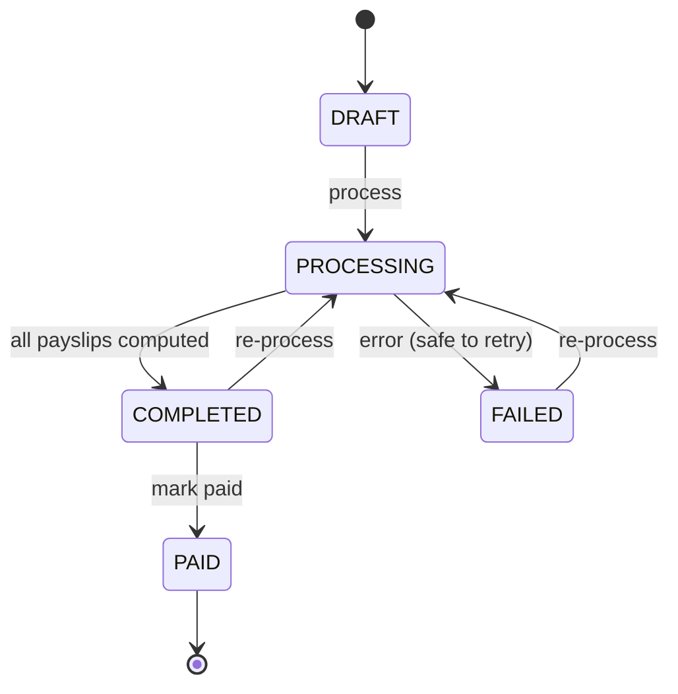

# 10 — Payroll: How It Works (Phase 3)

This is a practical guide to the Phase 3 **Payroll** module: what it does, the exact flow,
how pay is calculated (with a worked example), the roles involved, and what is intentionally
simplified for now.

Phase 3 added **no new database tables** — the `payroll_runs`, `payslips`, `payslip_lines`
and `statutory_rates` models were already in the schema from Phase 1, so the existing
migration created them.

## 10.1 What it does

Payroll turns each employee's **salary structure** into a **monthly payslip**: it derives the
monthly gross, applies statutory deductions (EPF, ESI, Professional Tax), and computes net
pay. Payslips are grouped into a **payroll run** for a given month, which moves through a
clear lifecycle and can be marked paid.

## 10.2 The flow (what HR does)


Step by step (exactly as verified in the app):

1. **Set salary** — HR opens an employee (Employees → click a row) and saves a salary
   structure: annual **CTC** and annual **Basic** (in ₹). Basic must not exceed CTC.
2. **Create a run** — Payroll → choose Month + Year → **Create run**. The run starts in
   `DRAFT`.
3. **Process** — click **Process**. For every *active* employee that has a salary structure,
   the engine computes a payslip and the run becomes `COMPLETED`, showing total gross and
   total net. Processing is **idempotent** — re-processing replaces the run's payslips.
4. **Review** — **View payslips** lists each employee's gross / deductions / net; **View**
   opens the itemised breakdown.
5. **Mark paid** — once disbursed, **Mark paid** moves the run to `PAID` (locked from
   re-processing).
6. **Employee view** — each employee sees only their own payslips under **Payroll → My
   payslips**, with the same breakdown.

### Run status lifecycle



## 10.3 How pay is calculated

All money is stored internally in **paise** (integer minor units) to avoid rounding errors,
and displayed as ₹.

**Inputs per employee**

- `monthlyGross = annual CTC ÷ 12`
- `monthlyBasic = annual Basic ÷ 12` (if no Basic component is set, defaults to 50% of gross)

**Earnings**

- `Basic` line = monthly basic
- `Allowances` line = monthly gross − monthly basic
- `Gross` = sum of earnings

**Statutory deductions** (rates come from the `statutory_rates` table, seeded for India — so
rate changes are a data update, not a code change):

| Component | Rule (employee share) |
|-----------|------------------------|
| **EPF** (Provident Fund) | 12% of **min(monthly basic, ₹15,000 ceiling)** |
| **ESI** (State Insurance) | 0.75% of gross, **only if gross ≤ ₹21,000** |
| **PT** (Professional Tax) | slab by state — e.g. Karnataka: ₹0 up to ₹25,000, then ₹200 |

**Net pay** = Gross − total deductions.

### Worked example (verified live)

Arjun Sharma — annual CTC ₹12,00,000, annual Basic ₹6,00,000:

| Line | Amount |
|------|-------:|
| Basic (₹6,00,000 ÷ 12) | ₹50,000 |
| Allowances (gross − basic) | ₹50,000 |
| **Gross** | **₹1,00,000** |
| EPF — 12% of capped ₹15,000 | −₹1,800 |
| ESI — gross > ₹21,000, so not applicable | — |
| Professional Tax — gross > ₹25,000 | −₹200 |
| **Total deductions** | **−₹2,000** |
| **Net pay** | **₹98,000** |

This matches the payslip the app produced and the automated unit tests
(`test/unit/payroll-calculator.spec.ts`).

## 10.4 Roles & permissions

| Action | Who |
|--------|-----|
| Set salary structure | HR_ADMIN / OWNER |
| Create / process / mark-paid a run, view all payslips | HR_ADMIN / OWNER |
| View **own** payslips | the employee (EMPLOYEE+) |

A non-HR employee can only ever see their own payslips — enforced in the service layer, not
just the UI.

## 10.5 API endpoints

| Method | Path | Role | Purpose |
|--------|------|------|---------|
| PUT | `/employees/:id/salary` | HR_ADMIN | Set/replace the active salary structure |
| POST | `/payroll/runs` | HR_ADMIN | Create a run (DRAFT) |
| POST | `/payroll/runs/:id/process` | HR_ADMIN | Compute payslips (idempotent) |
| POST | `/payroll/runs/:id/mark-paid` | HR_ADMIN | Mark a completed run paid |
| GET | `/payroll/runs` | HR_ADMIN | List runs |
| GET | `/payroll/runs/:id/payslips` | HR_ADMIN | Payslips in a run |
| GET | `/payslips` | EMPLOYEE | The caller's own payslips |
| GET | `/payslips/:id` | self / HR_ADMIN | One payslip with line items |

Full request/response shapes are in the live Swagger docs at
`http://localhost:3001/api/v1/docs`.

## 10.5b Activating the Phase-3-completion features (TDS, LOP, PDF)

These three were added after the first payroll release, so an existing local setup needs two
one-time steps before they work at runtime:

```bash
cd backend
npm install        # installs the new "pdfkit" dependency (payslip PDF)
npm run seed       # inserts the TDS statutory rate row (idempotent, safe to re-run)
```

The dev server (`npm run start:dev`) then recompiles automatically. Re-process a payroll run
(or create a new month's run) and the payslips will include the **TDS** line; the **Download
PDF** button streams a generated payslip PDF; and any month containing **ABSENT** attendance
days will show pro-rated **loss-of-pay**. (A run already marked `PAID` is locked — create or
re-process an unpaid run.)

## 10.6 What's simplified (and the path to "full")

Phase 3 deliberately keeps payroll focused and correct rather than exhaustive:

- **TDS** (income-tax withholding) — **implemented** as a simplified new-regime annual
  estimate (slabs + standard deduction + ₹7L rebate + 4% cess), taken monthly. It is *not* a
  substitute for a full tax engine (no per-employee declarations, perks, or regime choice).
- **Attendance-based loss-of-pay** — **implemented**: ABSENT days in the period pro-rate the
  month's gross (and basic). Unpaid-leave integration can extend this later.
- **Payslip PDFs** — **implemented**: generated on demand with `pdfkit` and streamed from
  `GET /payslips/:id/pdf` (no storage needed). Archiving PDFs to S3 is optional/future.
- **Employer contributions** (employer EPF/ESI share, gratuity, bonus) are modelled in the
  rate config but not shown on the employee payslip in v1.

## 10.7 How it's verified

- **Unit tests** (`backend`, Jest): EPF capping, ESI ceiling boundary, PT slab, net
  computation, loss-of-pay proration, and `daysInMonth` leap-year handling — all passing.
- **Manual end-to-end** (in the browser): set salary → create run → process → review payslip
  → mark paid → employee views own payslip. Each step produced the expected figures
  (₹1,00,000 gross → ₹98,000 net).
